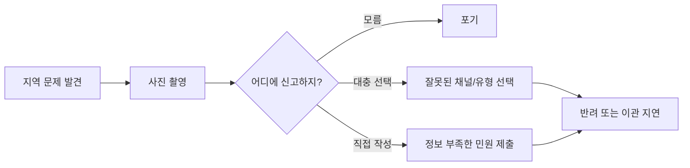
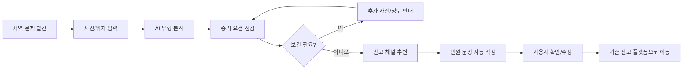
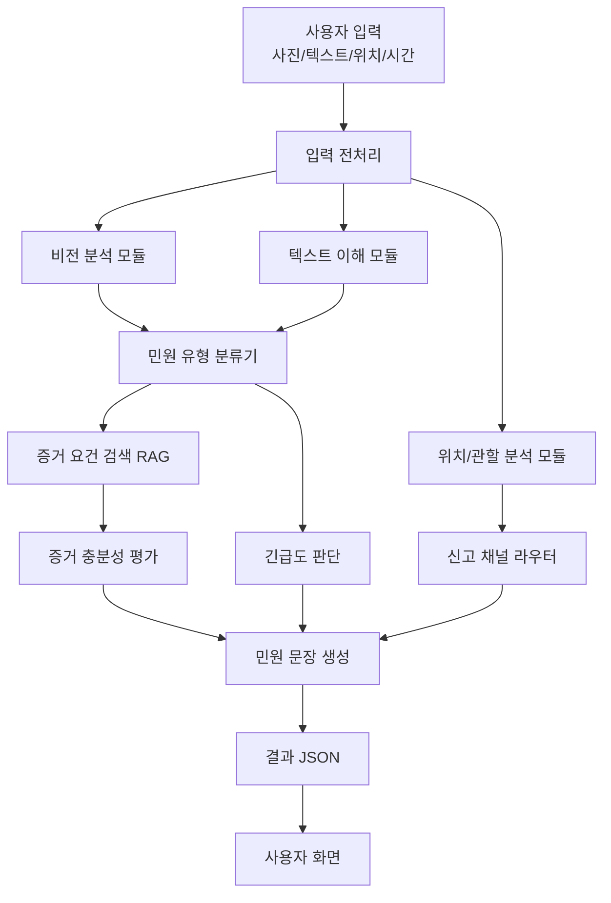
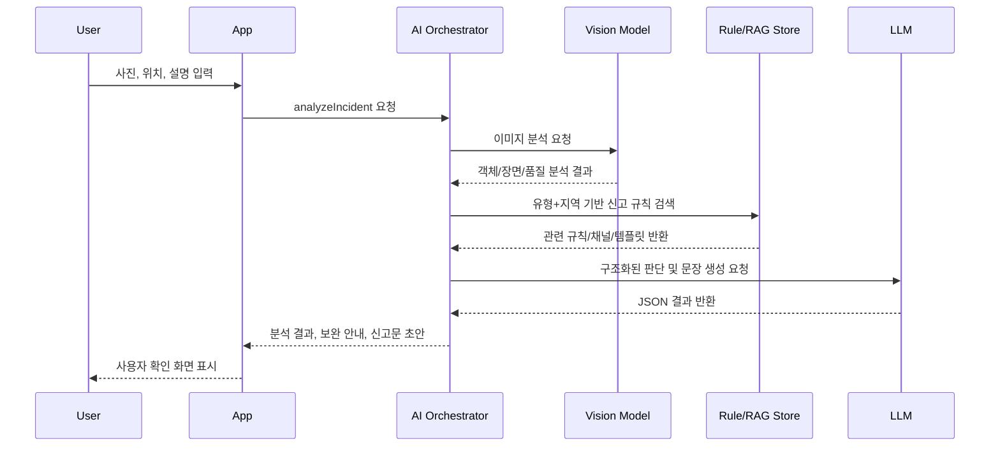
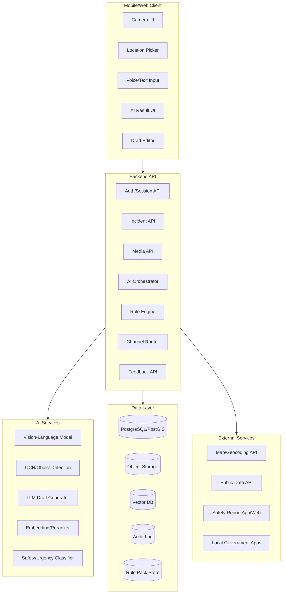
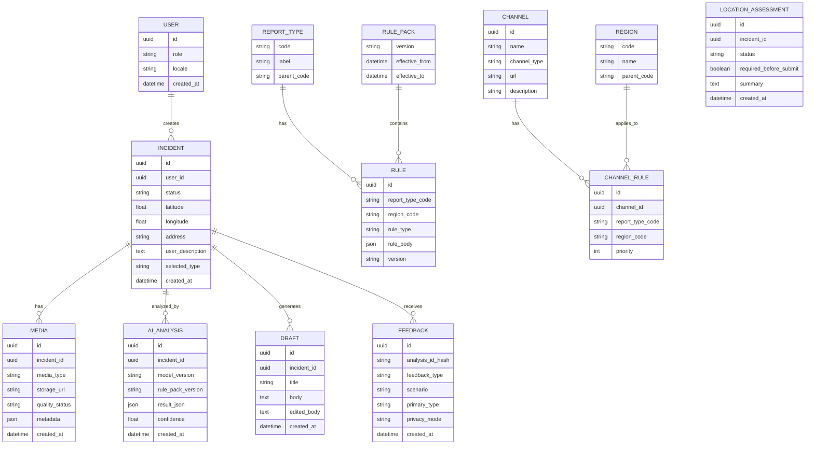
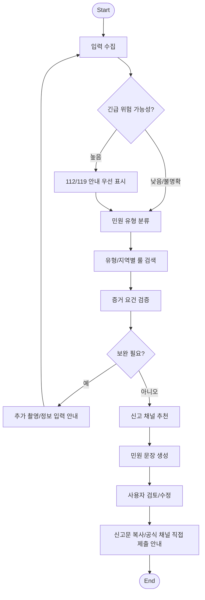

# Civic Copilot 개발 기획 및 개발 문서

> **프로젝트명**: Civic Copilot — 생활민원 신고 전 검증을 위한 도메인 특화 AI 코파일럿  
> **문서 유형**: 개발 기획서 + 제품 요구사항 + 시스템 설계서 + AI 설계서 + 발표/제출용 정리 문서  
> **버전**: v1.0  
> **작성일**: 2026-05-04  
> **대상 과제**: 소프트웨어프로젝트 I / AD 프로젝트  
> **핵심 한 줄**: 시민이 사진과 위치를 올리면 AI가 생활민원 유형, 신고 채널, 증거 충분성, 긴급도, 신고 문장을 미리 검토해 신고 실패와 행정 분류 오류를 줄이는 도메인 특화 AI 서비스.

---

## 0. 문서 목적

이 문서는 단순 PRD가 아니라, 실제 개발 프로젝트를 시작할 수 있을 정도로 세분화된 **개발 기획 및 개발 문서**이다. AD 프로젝트의 요구사항인 “AI를 활용한 지역사회 문제 해결”, “구현하지 않더라도 구현 가능성을 고려한 개념 설계”, “착안 → 조사 → 설계 → 발표” 흐름에 맞춰 작성되었다.

본 문서의 목표는 다음과 같다.

1. 프로젝트 주제의 문제 정의와 차별성을 명확히 한다.
2. 시장조사 결과를 반영하여 기존 서비스와의 중복을 피한다.
3. 실제 구현 가능한 AI/SW 시스템 구조를 설계한다.
4. 사용자 경험, 기능 요구사항, 데이터 구조, API, AI 모델, 보안, 평가 지표를 통합적으로 정리한다.
5. 7분 발표와 최종 보고서로 쉽게 변환할 수 있는 자료 기반을 제공한다.

---

## 1. 프로젝트 개요

### 1.1 프로젝트 배경

지역사회에는 매일 다양한 생활불편과 안전 문제가 발생한다.

- 보도블록 파손
- 도로 포트홀
- 쓰레기 무단투기
- 가로등/보안등 고장
- 불법주정차
- 빗물받이 막힘
- 공사장 소음
- 위험 시설물 노출

이러한 문제는 시민이 발견하는 순간 빠르게 신고되면 해결 가능성이 높다. 그러나 실제로는 많은 시민이 다음과 같은 이유로 신고를 포기하거나 부정확하게 신고한다.

- 어떤 앱이나 기관에 신고해야 하는지 모른다.
- 신고 유형 선택이 어렵다.
- 사진을 어떻게 찍어야 접수 가능한지 모른다.
- 신고 문장을 어떻게 써야 할지 모른다.
- 이미 누군가 신고했는지 모른다.
- 긴급 신고인지 일반 민원인지 판단하기 어렵다.
- 불법주정차처럼 증거 요건이 있는 경우, 사진 간격이나 번호판 식별 조건을 놓친다.

이미 안전신문고, 서울스마트 불편신고, 국민신문고 등 공공 신고 플랫폼은 존재한다. 따라서 본 프로젝트는 기존 신고 플랫폼을 대체하지 않는다. 대신 **시민이 신고하기 전 단계에서 막히는 문제**를 해결하는 AI 보조 레이어를 제안한다.

### 1.2 프로젝트 정의

**Civic Copilot**은 생활민원 도메인에 특화된 AI 코파일럿이다. 사용자가 사진, 위치, 간단한 설명을 입력하면 AI가 다음을 수행한다.

1. 사진과 텍스트를 분석하여 민원 유형 후보를 분류한다.
2. 위치와 민원 유형을 기반으로 적절한 신고 채널을 추천한다.
3. 신고가 접수되기 위해 필요한 증거 요건을 점검한다.
4. 사진 품질, 번호판/위치/위험 요소 식별 가능성 등을 확인한다.
5. 긴급도를 판단해 112/119 등 즉시 신고가 필요한 경우를 안내한다.
6. 시민이 그대로 사용할 수 있는 민원 문장을 자동 작성한다.
7. 중복 신고 가능성을 안내한다.
8. 기존 신고 플랫폼으로 이동하거나 신고 문장을 복사할 수 있게 한다.

### 1.3 핵심 포지셔닝

> 기존 서비스가 “신고 접수 창구”라면, Civic Copilot은 “신고 전 검증·작성 도우미”이다.

> 범용 ChatGPT가 아니라, 생활민원 신고라는 좁은 업무 흐름에 최적화된 **domain-specific AI agent**이다.

### 1.4 목표 사용자

- 일반 시민
- 대학가·주거지역 주민
- 디지털 사용이 어려운 고령층
- 한국어 민원 작성이 어려운 외국인 주민
- 반복 민원을 줄이고 싶은 지자체 담당자
- 지역 문제를 모니터링하려는 시민단체/학교 프로젝트 팀

### 1.5 서비스 형태

MVP 기준 서비스 형태는 다음과 같다.

- 모바일 앱 또는 모바일 웹
- 사진 촬영/업로드
- GPS 기반 위치 확인
- AI 분석 결과 화면
- 신고 문장 생성
- 신고 채널 추천 및 외부 앱/웹 연결
- 사용자 피드백 수집

---

## 2. 문제 정의

### 2.1 핵심 문제

생활민원 신고 서비스는 이미 존재하지만, 시민은 신고 이전 단계에서 다음 문제를 겪는다.

| 문제 영역 | 구체적 문제 | 결과 |
|---|---|---|
| 신고 채널 혼란 | 안전신문고, 국민신문고, 지자체 앱, 120, 112, 119 중 어디로 가야 할지 모름 | 신고 포기 또는 오접수 |
| 유형 선택 어려움 | 쓰레기, 도로, 교통, 시설물, 안전 등 분류가 복잡함 | 담당 부서 이관 지연 |
| 증거 요건 미충족 | 사진이 흐리거나, 번호판/위치/시간이 불명확함 | 반려 또는 재신고 필요 |
| 문장 작성 부담 | 민원 문장을 공손하고 구체적으로 쓰기 어려움 | 부정확한 신고 내용 |
| 긴급도 판단 실패 | 위험한 상황을 일반 민원으로 넣거나, 일반 민원을 긴급 신고로 착각 | 대응 지연 또는 행정 부담 |
| 중복 신고 | 이미 접수된 문제를 반복 신고 | 행정 처리 비효율 |
| 접근성 문제 | 고령층, 외국인, 디지털 약자는 앱 사용/문장 작성이 어려움 | 지역 문제의 신고 불평등 |

### 2.2 문제를 한 문장으로 정리

> 지역사회 생활불편은 신고 플랫폼의 부재보다, 시민이 신고 전에 “무엇을, 어디에, 어떻게, 어떤 증거로” 신고해야 하는지 모르는 문제 때문에 해결이 지연된다.

### 2.3 기존 방식의 한계

기존 신고 서비스들은 주로 다음 흐름을 따른다.

1. 사용자가 앱을 연다.
2. 신고 분야를 선택한다.
3. 사진/동영상을 첨부한다.
4. 위치를 입력한다.
5. 내용을 작성한다.
6. 접수한다.
7. 처리 결과를 확인한다.

이 구조는 이미 신고 의지가 있고, 신고 규칙을 어느 정도 이해하는 사용자에게는 충분하다. 하지만 다음과 같은 사용자를 적극적으로 돕지는 못한다.

- 신고할지 말지 고민하는 사용자
- 카테고리를 모르는 사용자
- 증거 요건을 모르는 사용자
- 문장 작성이 부담스러운 사용자
- 긴급 여부를 판단하지 못하는 사용자
- 민원이 반려될까 봐 포기하는 사용자

Civic Copilot은 바로 이 “신고 전 단계”를 제품의 핵심 문제 영역으로 삼는다.

---

## 3. 시장조사 및 경쟁 서비스 분석

### 3.1 조사 요약

시장조사 결과, 사진·위치 기반 생활민원 신고 서비스는 이미 존재한다. 또한 공공기관의 민원 처리 과정에도 AI 도입이 진행되고 있다. 따라서 본 프로젝트가 단순히 “AI 민원 신고 앱”으로 정의되면 차별성이 약하다.

하지만 기존 서비스 대부분은 **신고 접수 이후의 처리** 또는 **신고 접수 기능 자체**에 초점이 맞춰져 있다. Civic Copilot은 신고 접수 전의 검증, 작성, 채널 선택, 증거 보완을 담당하는 보조 레이어로 차별화한다.

### 3.2 경쟁/유사 서비스

#### 3.2.1 안전신문고

안전신문고는 안전, 생활불편, 불법주정차, 교통위반 등 다양한 신고를 받는 대표적인 공공 신고 앱이다. 안전신고 및 생활불편신고에서는 사진/동영상 첨부, GPS 기반 주소 검색, 신고 내용 입력이 요구된다. 불법주정차 신고의 경우에는 동일 위치에서 1분 이상 간격으로 2장 이상의 사진을 찍어야 하는 등 증거 요건이 존재한다. 또한 긴급한 화재·구조·구급은 119, 치안은 112로 신고하라는 안내가 제공된다.

**시사점**

- 사진·위치·내용 기반 신고 기능은 이미 존재한다.
- 신고 유형 선택과 증거 요건은 사용자가 직접 이해해야 한다.
- Civic Copilot은 안전신문고를 대체하는 것이 아니라, 안전신문고에 제출하기 전 사용자가 올바르게 준비하도록 돕는다.

#### 3.2.2 서울스마트 불편신고

서울스마트 불편신고는 서울시 생활불편사항을 신고하는 서비스이다. 신고 분야는 불법주정차, 불법현수막, 쓰레기무단투기, 보도블록파손, 보안등/가로등 파손, 소음, 하수시설, 도시시설물, 공사장불편, 안전신고 등을 포함한다. 신고된 민원은 120다산콜센터에서 접수하고 해당 부서에서 처리하며, 처리 과정과 결과를 앱으로 확인할 수 있다.

**시사점**

- 서울시 단위에서는 생활불편 신고 체계가 잘 갖춰져 있다.
- 지역별로 다른 신고 채널과 처리 구조가 존재한다.
- Civic Copilot은 지역별 신고 채널을 안내하고, 사용자가 사는 지역의 적절한 앱/기관으로 연결하는 메타 레이어가 될 수 있다.

#### 3.2.3 국민신문고 및 생성형 AI 기반 민원 처리

국민신문고 영역에서는 생성형 AI를 활용한 민원 답변 추천, 빈발 민원 일괄 처리, AI 기반 민원 분석 등이 추진되고 있다. 관련 발표에 따르면 AI가 관련 법령, 기존 민원 사례, 업무 매뉴얼 등을 분석해 답변 초안을 작성하고 담당자에게 제시하는 방향으로 활용된다.

**시사점**

- 공공 민원 처리 내부에서도 AI 도입이 시작되었다.
- 다만 이는 주로 담당자 업무 효율화에 가깝다.
- Civic Copilot은 시민이 신고를 제출하기 전에 AI 도움을 받는 시민 프론트엔드 서비스이다.

#### 3.2.4 AI 안전신문고

LG-KETI는 행정안전부 AI 안전신문고 1단계 연구개발을 완료하고 연내 시범 서비스를 준비 중이라고 밝혔다. 해당 시스템은 하루 3만 9천 건 이상의 안전 신고를 AI가 분석해 신고 접수, 선별, 분류, 담당 부서 이관, 답변 회신까지 자동화하는 차세대 신고 처리 시스템으로 설명된다. 기존 안전신문고의 키워드 기반 자동 분류는 오타나 불명확한 문구, 사진/영상 확인에서 한계가 있어 비전언어모델을 적용한다는 설명도 있다.

**시사점**

- AI 기반 신고 분류·이관은 이미 공공영역에서도 진행 중이다.
- 단순 자동 분류 아이디어만으로는 차별성이 부족하다.
- Civic Copilot은 “접수 후 자동 처리”가 아니라 “접수 전 사용자 보조”를 핵심 차별점으로 삼아야 한다.

#### 3.2.5 민원 빅데이터 개방 시스템

국민권익위원회는 “한눈에 보는 민원 빅데이터”를 통해 주요 민원창구의 민원 현황과 분석 정보를 공개하고, 오늘의 민원이슈, 급증키워드, 분야별 현황 등 데이터를 개방한다. 공공데이터포털에는 국민권익위원회 민원빅데이터 분석정보 API도 제공되어 급증 키워드, 핵심 키워드, 유사사례, 민원발생 지역 순위 등 데이터를 조회할 수 있다.

**시사점**

- 민원 데이터 분석은 외부 서비스 설계에 활용 가능한 공공 데이터가 존재한다.
- Civic Copilot은 지역별 민원 트렌드, 중복 가능성, 카테고리 추천의 보조 자료로 이 데이터를 활용할 수 있다.

### 3.3 경쟁 서비스 비교표

| 구분 | 안전신문고 | 서울스마트 불편신고 | 국민신문고 AI | AI 안전신문고 | Civic Copilot |
|---|---|---|---|---|---|
| 주요 목적 | 안전/생활불편 신고 접수 | 서울시 생활불편 신고 | 민원 답변/분석 지원 | 안전 신고 자동 처리 | 신고 전 검증·작성 지원 |
| 주요 사용자 | 시민 | 서울 시민 | 행정 담당자 중심 | 행정 처리 시스템 | 시민, 특히 신고 초보자 |
| 사진 분석 | 일부 필요, 향후 AI 강화 | 사진 첨부 중심 | 주로 텍스트/민원 데이터 | 비전언어모델 기반 | 사진 품질/증거 요건 점검 |
| 위치 활용 | GPS/지도 | 지도 기반 | 민원 데이터 분석 | 신고 분류 보조 | 관할/채널 추천, 중복 감지 |
| AI 활용 | 일부 자동 분류/향후 강화 | 제한적 | 답변 추천/분석 | 선별·분류·이관 | 시민 UX 중심 AI 코파일럿 |
| 차별점 | 공식 신고 창구 | 서울 특화 | 내부 처리 효율 | 공공 신고 자동화 | 신고 실패 방지, 도메인 특화 보조 |
| 한계 | 사용자가 요건을 알아야 함 | 지역 제한 | 시민 앞단 UX 아님 | 접수 후 처리 중심 | 공식 접수 권한 없음, 연계 필요 |

### 3.4 시장조사 결론

1. “사진 + 위치 + 민원 내용으로 신고”는 이미 존재한다.
2. “AI가 민원 분류와 담당 부서 이관을 한다”도 도입 중이다.
3. 따라서 본 프로젝트는 신고 플랫폼을 새로 만드는 것이 아니라, 기존 플랫폼의 앞단에서 시민을 도와주는 AI 코파일럿으로 정의해야 한다.
4. 차별화 포인트는 **신고 전 검증**, **증거 요건 안내**, **채널 추천**, **민원 문장 작성**, **접수 실패 예방**, **접근성 개선**이다.

---

## 4. 제품 비전 및 목표

### 4.1 제품 비전

> 시민이 지역 문제를 발견했을 때, 신고 절차를 몰라도 AI의 도움으로 정확하고 빠르게 신고할 수 있는 사회를 만든다.

### 4.2 제품 미션

- 생활민원 신고의 진입장벽을 낮춘다.
- 잘못된 신고, 반려, 중복 신고를 줄인다.
- 시민의 관찰을 행정 처리 가능한 정보로 변환한다.
- 기존 공공 신고 플랫폼의 사용성을 보완한다.
- 지역사회 문제 해결 속도를 높인다.

### 4.3 핵심 가치 제안

| 대상 | 가치 |
|---|---|
| 시민 | 신고 방법을 몰라도 AI가 안내한다. |
| 고령층/외국인 | 쉬운 문장, 음성 입력, 번역 지원으로 접근성을 높인다. |
| 행정기관 | 부정확한 신고, 중복 신고, 잘못된 분류를 줄인다. |
| 지역사회 | 위험 요소와 생활불편을 더 빠르게 발견하고 개선한다. |
| 개발/연구 관점 | 도메인 특화 AI agent 설계 사례가 된다. |

### 4.4 프로젝트 목표

#### 정성 목표

- 시민이 “이걸 어디에 신고하지?”라는 고민 없이 신고 준비를 완료하게 한다.
- 민원 내용을 행정 담당자가 이해하기 쉬운 문장으로 바꾼다.
- 사진과 위치의 증거 품질을 높인다.
- 긴급한 위험 상황을 일반 민원으로 방치하지 않도록 한다.

#### 정량 목표 — MVP 가정

| 지표 | 목표 |
|---|---:|
| AI 민원 유형 Top-3 추천 정확도 | 85% 이상 |
| 신고 채널 추천 정확도 | 80% 이상 |
| 문장 생성 사용자 만족도 | 4.0/5.0 이상 |
| 증거 보완 안내 후 신고 가능률 | 30% 이상 개선 |
| 사용자가 신고문 초안을 수정 없이 사용하는 비율 | 50% 이상 |
| 긴급 신고 안내 누락률 | 5% 이하 |
| 중복 신고 가능성 탐지 정밀도 | 70% 이상 |

---

## 5. 사용자 및 이해관계자 분석

### 5.1 주요 페르소나

#### Persona A. 대학생 시민 신고자

- 이름: 김민수
- 나이: 22세
- 상황: 학교 근처 보도블록이 파손되어 넘어질 뻔함
- 문제: 어디에 신고해야 할지 몰라 그냥 사진만 찍고 지나감
- 니즈: 사진만 올리면 신고 문장과 신고처를 알려주길 원함
- 성공 경험: AI가 “보도블록 파손/보행 안전 위험”으로 분류하고 구청/안전신문고 신고 문장을 작성해 줌

#### Persona B. 고령층 사용자

- 이름: 박영자
- 나이: 68세
- 상황: 동네 가로등이 며칠째 꺼져 있어 밤길이 위험함
- 문제: 앱 사용과 민원 문장 작성이 어려움
- 니즈: 음성으로 설명하면 쉬운 안내를 받고 싶음
- 성공 경험: “이 위치의 보안등 고장 신고입니다. 사진을 한 장 더 찍어주세요”처럼 단계별 안내를 받음

#### Persona C. 외국인 주민

- 이름: Anna
- 나이: 29세
- 상황: 집 앞 쓰레기 무단투기를 신고하고 싶음
- 문제: 한국어 민원 문장과 신고 채널을 모름
- 니즈: 영어로 입력하면 한국어 신고 문장을 만들어주길 원함
- 성공 경험: 영어 설명이 자연스러운 한국어 민원 문장으로 변환됨

#### Persona D. 행정 담당자

- 이름: 이지훈
- 나이: 36세
- 상황: 중복·오분류 민원이 반복되어 처리 시간이 길어짐
- 문제: 사진 품질이 낮고 위치가 부정확한 신고가 많음
- 니즈: 접수 전부터 시민이 정확한 정보를 입력하길 원함
- 성공 경험: Civic Copilot을 거친 신고는 사진, 위치, 문장이 명확해 처리 효율이 높아짐

### 5.2 이해관계자

| 이해관계자 | 관심사 | Civic Copilot 제공 가치 |
|---|---|---|
| 시민 | 쉽고 빠른 신고 | AI 안내, 문장 작성, 채널 추천 |
| 지자체 | 정확한 접수와 처리 효율 | 오분류·중복·증거부족 감소 |
| 중앙정부 신고 플랫폼 | 접수 품질 향상 | 기존 서비스 이용률과 품질 개선 |
| 지역 커뮤니티 | 문제 해결 가시화 | 중복 신고 방지, 지역 문제 지도 |
| 개발팀 | 구현 가능성 | 공개 API, 지도, VLM/LLM, RAG 활용 |
| 교수/평가자 | 논리적 설계 | 문제 정의, 시장조사, 요소기술, 시스템 구조 |

---

## 6. 사용자 여정

### 6.1 현재 사용자 여정 — 문제 있는 흐름



### 6.2 Civic Copilot 적용 후 사용자 여정



### 6.3 핵심 사용 시나리오

#### 시나리오 1. 보도블록 파손

1. 사용자가 파손된 보도블록 사진을 촬영한다.
2. GPS 위치가 자동 입력된다.
3. AI가 사진에서 “보도블록 파손/보행 위험”을 감지한다.
4. AI가 사진 품질을 확인한다.
5. “파손 부위가 보이나, 전체 위치가 부족합니다. 주변 표지판이나 건물 일부가 보이도록 한 장 더 찍으면 좋습니다.”라고 안내한다.
6. 추가 사진을 올리면 AI가 신고 가능으로 판단한다.
7. 구청 도로관리 부서 또는 안전신문고 생활불편 신고를 추천한다.
8. 민원 문장을 생성한다.

생성 문장 예시:

> 서울시 ○○구 ○○로 인근 보도블록이 파손되어 보행자가 걸려 넘어질 위험이 있습니다. 특히 야간에는 식별이 어려워 안전사고가 우려되므로 현장 확인 및 보수 조치를 요청드립니다.

#### 시나리오 2. 불법주정차

1. 사용자가 횡단보도 위에 정차한 차량 사진을 촬영한다.
2. AI가 차량, 횡단보도, 번호판 식별 가능 여부를 확인한다.
3. 시스템이 “불법주정차 신고는 1분 이상 간격의 동일 위치 사진 2장 이상이 필요할 수 있습니다”라고 안내한다.
4. 타이머가 작동한다.
5. 1분 후 두 번째 사진 촬영을 안내한다.
6. AI가 배경 동일성, 차량번호 식별 가능성, 촬영시간 존재 여부를 점검한다.
7. 신고 문장을 생성하고 안전신문고 불법주정차 신고로 연결한다.

#### 시나리오 3. 긴급 위험 상황

1. 사용자가 전선이 끊어져 보도에 걸쳐 있는 사진을 올린다.
2. AI가 “감전 위험 가능성”으로 판단한다.
3. 일반 민원 문장 생성 대신 다음 안내를 우선 표시한다.

> 현재 상황은 즉시 안전 조치가 필요한 위험 상황일 수 있습니다. 가까이 접근하지 말고, 긴급 구조·안전 신고가 필요한 경우 119 또는 관할 기관에 즉시 연락하세요.

4. 그 후 보조적으로 안전신문고 신고 문장을 작성한다.

---

## 7. 기능 범위

### 7.1 MVP 범위

MVP는 “신고 전 검증·작성”에 집중한다. 공식 신고 접수 시스템과 직접 연동하지 않고, 사용자가 기존 신고 앱/웹으로 이동하거나 신고 문장을 복사하는 방식으로 설계한다.

#### MVP 포함 기능

| 기능 | 설명 |
|---|---|
| 사진 업로드/촬영 | 현장 사진 1~4장 입력 |
| 위치 확인 | GPS 기반 위치 확인 및 사용자의 수동 수정 |
| 간단 설명 입력 | 텍스트 또는 음성으로 문제 설명 입력 |
| AI 유형 분류 | 생활민원 유형 Top-3 추천 |
| 증거 요건 점검 | 사진 품질, 번호판, 위치, 시간, 추가 사진 필요 여부 확인 |
| 신고 채널 추천 | 안전신문고, 지자체 앱, 120, 112/119 등 추천 |
| 민원 문장 생성 | 행정 제출용 문장 자동 생성 |
| 긴급도 판단 | 일반/주의/긴급 후보 분류 |
| 중복 가능성 안내 | 동일 위치·유형의 최근 사례 기반 중복 가능성 표시 |
| 결과 복사/공유 | 생성 문장 복사, 외부 신고 앱 링크 안내 |

#### MVP 제외 기능

| 제외 기능 | 제외 이유 |
|---|---|
| 공공기관 API 직접 접수 | 공식 연계와 인증/법적 책임 필요 |
| 자동 민원 제출 | 오신고·허위신고 책임 문제 |
| 담당 공무원 배정 자동화 | 행정 내부 시스템 권한 필요 |
| 법적 판단/과태료 확정 | 법률적 판단은 행정기관 권한 |
| 얼굴/개인 식별 분석 | 개인정보 위험 |
| 실시간 구조 요청 대행 | 긴급 서비스 책임과 안전 문제 |

### 7.2 확장 범위

| 단계 | 확장 기능 |
|---|---|
| Phase 2 | 지역별 신고 앱 deep link, 외국어 입력, 음성 안내, 접근성 강화 |
| Phase 3 | 지자체 협약 기반 신고 데이터 연계, 처리 결과 추적, 공공 API 연동 |
| Phase 4 | 지역 문제 지도, 시민 참여 리워드, 행정 대시보드 |
| Phase 5 | 예측형 민원 예방: 우천 전 빗물받이 막힘 위험 지도 등 |

---

## 8. 기능 요구사항

### 8.1 요구사항 우선순위 기준

- **P0**: MVP 필수. 없으면 핵심 가치가 무너지는 기능.
- **P1**: MVP에 있으면 좋고, 시연/설득력이 높아지는 기능.
- **P2**: 확장 기능. 발표에서는 미래 계획으로 제시 가능.

### 8.2 기능 요구사항 목록

| ID | 기능명 | 우선순위 | 설명 | 성공 기준 |
|---|---|---:|---|---|
| FR-001 | 사진 입력 | P0 | 사용자는 현장 사진을 촬영하거나 업로드할 수 있다. | 1~4장 입력 가능 |
| FR-002 | 위치 입력 | P0 | GPS로 위치를 자동 감지하고 사용자가 수정할 수 있다. | 주소/좌표 저장 |
| FR-002A | 위치/증거 완성도 | P1 | 위치가 없으면 지도 위치, 주변 기준점, 사진 배경 보완을 안내한다. | 위치 누락 시 공식 제출 전 보완 표시 |
| FR-002B | 사진 증거 완성도 | P1 | 사진이 없으면 현장 사진, 전체 배경 사진, 근접 사진 보완을 안내한다. | 사진 미첨부 시 공식 제출 전 보완 표시 |
| FR-003 | 설명 입력 | P0 | 사용자는 짧은 텍스트나 음성으로 상황을 설명할 수 있다. | 900자 이하 권장 |
| FR-004 | 민원 유형 분류 | P0 | AI가 사진/텍스트 기반으로 민원 유형 Top-3를 추천한다. | 유형, 신뢰도, 근거 제공 |
| FR-005 | 증거 요건 점검 | P0 | AI가 신고 가능성을 높이기 위한 보완 사항을 알려준다. | 보완 필요 여부와 이유 표시 |
| FR-006 | 신고 채널 추천 | P0 | AI가 적합한 신고 채널을 추천한다. | 1순위/대안 채널 표시 |
| FR-006A | 지역 채널 라우팅 | P0 | 서울 생활불편, 비서울/지역 불명, 긴급 상황에 따라 신고 채널 우선순위를 분리한다. | 서울 스마트 불편신고/안전신문고/120 대안 표시 |
| FR-007 | 긴급도 판단 | P0 | 위험한 상황이면 112/119 등 긴급 안내를 우선한다. | 긴급 안내 누락 최소화 |
| FR-007A | 추천 근거/불확실성 | P0 | AI 추천 근거, 한계, 공식 출처, 사용자 최종 확인 경계를 표시한다. | 유형/채널/증거/자동 제출 금지 근거 표시 |
| FR-008 | 민원 문장 생성 | P0 | AI가 제출 가능한 민원 문장을 작성한다. | 위치/문제/요청 포함 |
| FR-009 | 문장 편집 | P0 | 사용자가 AI 문장을 사실 확인, 과장 제거, 개인정보 제거 기준으로 수정할 수 있다. | 수정 후 복사/다운로드 가능, MVP는 수정본 원문 미저장 |
| FR-010 | 결과 복사 | P0 | 생성된 문장을 클립보드에 복사할 수 있다. | 원터치 복사 |
| FR-011 | 외부 신고 안내 | P0 | 안전신문고/지자체 앱/120 등으로 이동 방법을 안내하되 자동 제출하지 않는다. | 링크와 제출 전 확인 표시 |
| FR-012 | 중복 가능성 확인 | P1 | 동일 위치/유형의 최근 신고 가능성을 표시한다. | 중복 가능성 낮음/중간/높음 |
| FR-013 | 추가 촬영 가이드 | P1 | 필요한 사진 구도를 안내한다. | 예: 번호판, 전체 배경, 파손 부위 |
| FR-014 | 불법주정차 타이머 | P1 | 1분 간격 등 증거 요건을 맞추기 위한 타이머를 제공한다. | 두 번째 촬영 알림 |
| FR-015 | 다국어 입력 | P1 | 외국어 설명을 한국어 민원 문장으로 변환한다. | 영어→한국어 우선 |
| FR-016 | 음성 입력/읽어주기 | P1 | 고령층 접근성을 위해 음성 기능을 제공한다. | STT/TTS 연동 |
| FR-016A | 쉬운 다음 단계 | P1 | 디지털 취약 사용자와 외국인 주민을 위해 제출 전 행동을 쉬운 3단계로 요약한다. | 사진/위치 확인, 신고문 복사, 공식 제출 표시 |
| FR-017 | 사용자 피드백 | P1 | AI 추천이 맞았는지 선택형 비식별 피드백으로 평가한다. | 신고문 도움됨/보완 필요/공식 제출 완료, 위치·신고문 원문 미저장 |
| FR-018 | 지역별 규칙 관리 | P1 | 지역·유형별 신고 규칙을 관리자 화면에서 관리한다. | 룰 버전 관리 |
| FR-019 | 행정 대시보드 | P2 | 지역별 신고 전 상담 데이터를 시각화한다. | 지도/유형/시간대 분석 |
| FR-020 | 공식 신고 연동 | P2 | 기관 협약 후 직접 접수 API를 연동한다. | 인증/권한/감사로그 필요 |

---

## 9. 비기능 요구사항

| ID | 구분 | 요구사항 | 목표 |
|---|---|---|---|
| NFR-001 | 응답 속도 | 일반 분석 결과는 10초 이내 제공 | P95 10초 이하 |
| NFR-002 | 안정성 | AI 실패 시 기본 수동 안내 제공 | fallback UI 제공 |
| NFR-003 | 개인정보 | 불필요한 개인정보는 수집하지 않음 | 최소 수집 원칙 |
| NFR-004 | 보안 | 전송/저장 데이터 암호화 | TLS, 저장 암호화 |
| NFR-005 | 설명 가능성 | AI 판단 근거를 사용자에게 간단히 표시 | “왜 이 유형인지” 제공 |
| NFR-006 | 접근성 | 큰 글씨, 음성 입력, 쉬운 표현 지원 | WCAG 원칙 참고 |
| NFR-007 | 정확성 | 위험 상황 오판을 줄이기 위해 보수적 판단 | 긴급 후보는 강하게 안내 |
| NFR-008 | 확장성 | 지역별 규칙과 신고 채널을 쉽게 추가 | 룰 DB 기반 |
| NFR-009 | 감사성 | AI 결과, 룰 버전, 사용자 수정 신호를 목적별로 분리하고 원문 저장은 동의 기반으로 제한 | 분쟁/개선용 로그와 원문 미저장 정책 분리 |
| NFR-010 | 피드백 최소수집 | 피드백은 선택값과 시나리오 수준 정보만 저장 | 위치·신고문 원문·사진 원본 제외 |
| NFR-011 | 책임 제한 | AI 결과가 행정 처분 확정이 아님을 명확히 고지 | 고지 문구 상시 표시 |

---

## 10. 도메인 모델

### 10.1 주요 도메인 개념

| 개념 | 설명 |
|---|---|
| Incident | 사용자가 발견한 지역 문제 사건 |
| Report Type | 민원 유형. 예: 불법주정차, 쓰레기, 도로파손 |
| Evidence | 사진, 위치, 시간, 설명 등 신고 증거 |
| Evidence Requirement | 유형별 신고 요건. 예: 사진 2장, 번호판 식별 가능 |
| Channel | 신고 채널. 예: 안전신문고, 서울스마트 불편신고, 120, 112, 119 |
| Jurisdiction | 관할 지역/기관 |
| Urgency | 긴급도. 일반/주의/긴급 후보 |
| Draft | AI가 생성한 민원 문장 |
| Duplicate Candidate | 중복 가능성이 있는 유사 사례 |
| Rule Pack | 지역·유형별 신고 규칙 묶음 |

### 10.2 민원 유형 분류 체계 — MVP

| 대분류 | 세부 유형 | 예시 |
|---|---|---|
| 교통 | 불법주정차 | 횡단보도, 버스정류장, 소방시설 주변 주정차 |
| 도로 | 도로 파손/포트홀 | 차도 구멍, 침하, 균열 |
| 보행 | 보도블록 파손 | 보행로 파손, 장애물, 미끄럼 위험 |
| 환경 | 쓰레기 무단투기 | 생활쓰레기, 대형폐기물 방치 |
| 시설 | 가로등/보안등 고장 | 점등 불량, 파손 |
| 배수 | 빗물받이 막힘 | 낙엽/쓰레기 막힘, 침수 우려 |
| 안전 | 위험 시설물 | 맨홀 파손, 전선 노출, 낙하 위험 |
| 소음 | 생활/공사장 소음 | 야간 소음, 공사장 불편 |

### 10.3 긴급도 분류

| 등급 | 의미 | 예시 | 시스템 행동 |
|---|---|---|---|
| U0 일반 | 생활불편 중심 | 쓰레기 방치, 가로등 고장 | 일반 신고 문장 생성 |
| U1 주의 | 안전사고 가능성 | 보도블록 파손, 포트홀 | 빠른 신고 권장, 위험 문구 강화 |
| U2 긴급 후보 | 즉시 위험 가능성 | 전선 노출, 화재, 붕괴 위험 | 112/119 안내 우선, 접근 금지 안내 |

---

## 11. AI 시스템 설계

### 11.1 AI 설계 철학

Civic Copilot의 AI는 단순 챗봇이 아니라, 생활민원 신고 업무를 수행하는 도메인 특화 agent이다. 따라서 다음 원칙을 적용한다.

1. **업무 흐름 중심**: 자유 대화보다 신고 준비 단계별 판단에 집중한다.
2. **멀티모달 입력**: 사진, 텍스트, 위치, 시간 정보를 함께 사용한다.
3. **RAG 기반 도메인 지식**: 신고 규칙, 채널, 지역 정보를 외부 지식으로 검색한다.
4. **보수적 안전 판단**: 긴급 가능성이 있으면 일반 민원보다 긴급 안내를 우선한다.
5. **검증 가능한 출력**: AI 결과는 JSON 구조로 생성하여 UI와 로그에서 검증 가능하게 한다.
6. **사용자 최종 확인**: AI가 자동 제출하지 않고 사용자가 검토·수정한다.

### 11.2 AI 구성 요소



### 11.3 AI 모듈 상세

#### 11.3.1 Vision Understanding Module

입력: 이미지 1~4장  
출력: 시각적 객체/장면/위험 요소

주요 판단:

- 차량, 횡단보도, 버스정류장, 소화전, 보도, 도로, 쓰레기, 가로등, 맨홀 등 객체 탐지
- 사진 흐림 여부
- 야간/역광/가림 여부
- 문제 대상이 중앙에 있는지
- 위치 단서가 보이는지
- 번호판/차량/위반 장소 식별 가능성
- 위험 요소 존재 가능성

예상 기술:

- 비전언어모델 VLM
- 객체 탐지 모델
- OCR
- 이미지 품질 평가 모델
- 번호판/얼굴 등 개인정보 마스킹 모델

#### 11.3.2 Text Understanding Module

입력: 사용자의 짧은 설명  
출력: 문제 요약, 키워드, 감정/긴급 표현, 누락 정보

예시:

입력: “학교 앞 길이 깨져서 넘어질 뻔함”  
분석:

```json
{
  "problem_summary": "학교 앞 보행로 파손으로 보행자 넘어짐 위험",
  "keywords": ["보도", "파손", "보행 위험"],
  "possible_type": "sidewalk_damage",
  "urgency_hint": "주의"
}
```

#### 11.3.3 Complaint Type Classifier

역할: 사진, 텍스트, 위치 정보를 종합하여 민원 유형 후보를 추천한다.

출력 예시:

```json
{
  "top_types": [
    {
      "type_code": "SIDEWALK_DAMAGE",
      "label": "보도블록/보행로 파손",
      "confidence": 0.91,
      "evidence": ["파손된 보도 표면이 보임", "사용자 설명에 '길이 깨짐' 포함"]
    },
    {
      "type_code": "ROAD_DAMAGE",
      "label": "도로 파손",
      "confidence": 0.41,
      "evidence": ["포장면 손상으로 보이나 보행로/차도 구분이 불명확"]
    }
  ]
}
```

#### 11.3.4 Evidence Checker

역할: 신고가 접수될 가능성을 높이기 위해 필요한 증거 요건을 확인한다.

검사 항목:

- 사진 개수
- 사진 선명도
- 문제 대상 식별 가능성
- 위치 단서 포함 여부
- 촬영 시간 존재 여부
- 유형별 필수 정보 충족 여부
- 불법주정차의 경우 번호판 식별, 장소 식별, 시간 간격, 동일 배경 여부

출력 예시:

```json
{
  "status": "NEEDS_MORE_EVIDENCE",
  "score": 0.62,
  "missing_items": [
    "주변 위치를 알 수 있는 사진이 부족합니다.",
    "파손 부위가 확대되어 전체 맥락이 부족합니다."
  ],
  "recommendations": [
    "주변 건물, 표지판, 도로명이 함께 보이도록 한 장 더 촬영하세요.",
    "파손 부위와 보행로 전체가 함께 보이게 촬영하세요."
  ]
}
```

#### 11.3.5 Channel Router

역할: 민원 유형, 위치, 긴급도에 따라 신고 채널을 추천한다.

입력:

- 민원 유형
- 위치 좌표/주소
- 긴급도
- 사용자의 지역
- 지역별 신고 채널 DB

출력:

```json
{
  "primary_channel": {
    "name": "안전신문고",
    "reason": "보행 안전 위험이 있는 생활불편/안전 신고에 적합합니다.",
    "action": "앱에서 생활불편신고 또는 안전신고 유형을 선택하세요."
  },
  "alternative_channels": [
    {
      "name": "관할 구청 민원",
      "reason": "보도 유지보수는 관할 지자체에서 처리할 수 있습니다."
    }
  ],
  "emergency_notice": null
}
```

#### 11.3.6 Urgency Triage Module

역할: 즉각적인 안전 위험 가능성을 판단한다.

긴급 후보 예시:

- 화재, 연기, 폭발 위험
- 감전 위험
- 맨홀 뚜껑 없음
- 건물 외벽 낙하 위험
- 도로 대형 싱크홀
- 사람의 생명·신체에 즉시 위험 가능성

출력 원칙:

- 확실하지 않아도 위험 가능성이 크면 긴급 안내를 표시한다.
- 단, AI가 “긴급 상황 확정”이라고 단정하지 않는다.
- 사용자가 실제 현장에서 판단하고 112/119에 연락하도록 안내한다.

#### 11.3.7 Draft Generator

역할: 행정기관에 제출하기 적합한 민원 문장을 작성한다.

문장 구성 원칙:

1. 위치
2. 문제 상황
3. 위험/불편 내용
4. 요청 사항
5. 첨부 사진 설명
6. 과도한 감정 표현 배제
7. 법적 단정 표현 최소화

템플릿:

```text
[위치] 인근에서 [문제 상황]이 확인됩니다.
해당 문제로 인해 [위험/불편]이 발생할 우려가 있어
현장 확인 및 [요청 조치]를 요청드립니다.
첨부 사진을 참고 부탁드립니다.
```

예시:

> 서울시 ○○구 ○○로 ○○ 앞 보도에 보도블록 파손이 확인됩니다. 보행자가 걸려 넘어질 위험이 있으며, 특히 야간에는 식별이 어려워 안전사고가 우려됩니다. 현장 확인 후 보수 조치를 요청드립니다. 첨부 사진을 참고 부탁드립니다.

### 11.4 RAG 지식베이스 설계

#### 11.4.1 RAG가 필요한 이유

LLM은 일반 지식에는 강하지만, 다음과 같은 지역/시점/유형별 규칙을 항상 정확히 알 수 없다.

- 지역별 신고 채널
- 불법주정차 증거 요건
- 지자체별 민원 처리 부서
- 특정 유형의 신고 안내 문구
- 최근 정책 변경
- 앱별 입력 제한

따라서 AI 모델이 자체 기억만으로 답하지 않고, 관리자가 검증한 규칙 문서와 공공 데이터를 검색해 근거 기반으로 답하도록 설계한다.

#### 11.4.2 지식베이스 구성

| 컬렉션 | 내용 | 예시 |
|---|---|---|
| `report_type_rules` | 유형별 신고 요건 | 불법주정차 사진 2장, 위치/시간 필요 |
| `channel_directory` | 신고 채널 정보 | 안전신문고, 서울스마트 불편신고, 120 |
| `jurisdiction_rules` | 지역별 관할 정보 | 서울시/구청/동주민센터 등 |
| `draft_templates` | 민원 문장 템플릿 | 도로 파손, 쓰레기, 가로등 고장 |
| `emergency_rules` | 긴급 안내 규칙 | 화재/감전/붕괴 위험 시 119/112 안내 |
| `faq` | 사용자 FAQ | 사진 몇 장 필요?, 익명 신고 가능? |
| `public_data_refs` | 공공데이터/API 설명 | 민원 빅데이터 API 등 |

#### 11.4.3 RAG 검색 흐름



### 11.5 AI 출력 스키마

```json
{
  "incident_id": "inc_123456",
  "summary": "보도블록 파손으로 인한 보행 위험",
  "report_type": {
    "primary": "SIDEWALK_DAMAGE",
    "label": "보도블록/보행로 파손",
    "confidence": 0.91,
    "alternatives": [
      {"type": "ROAD_DAMAGE", "confidence": 0.41},
      {"type": "HAZARDOUS_FACILITY", "confidence": 0.23}
    ]
  },
  "urgency": {
    "level": "U1",
    "label": "주의",
    "reason": "보행자가 걸려 넘어질 수 있는 안전 위험이 있습니다.",
    "emergency_notice": null
  },
  "evidence_check": {
    "status": "PASS_WITH_RECOMMENDATION",
    "score": 0.78,
    "missing_items": ["주변 위치 단서가 더 있으면 좋습니다."],
    "recommendations": ["가능하면 주변 건물이나 도로명이 보이도록 추가 촬영하세요."]
  },
  "channel_recommendation": {
    "primary": "안전신문고",
    "reason": "보행 안전과 관련된 생활불편/안전 신고입니다.",
    "alternatives": ["관할 구청 민원", "120 다산콜센터"]
  },
  "draft": {
    "title": "보도블록 파손으로 인한 보행 위험 신고",
    "body": "서울시 ○○구 ○○로 인근 보도블록이 파손되어 보행자가 걸려 넘어질 위험이 있습니다. 현장 확인 후 보수 조치를 요청드립니다. 첨부 사진을 참고 부탁드립니다."
  },
  "duplicate_check": {
    "level": "LOW",
    "message": "동일 위치의 최근 유사 신고는 확인되지 않았습니다."
  },
  "disclaimer": "AI 분석 결과는 신고 준비를 돕기 위한 참고 정보이며, 최종 신고 내용은 사용자가 확인해야 합니다."
}
```

---

## 12. 시스템 아키텍처

### 12.1 전체 구조



### 12.2 컴포넌트 설명

| 컴포넌트 | 역할 |
|---|---|
| Mobile/Web Client | 사진 촬영, 위치 확인, 결과 표시, 신고문 편집 |
| Backend API | 사용자 요청 처리, AI 호출 조율, MVP에서는 분석 요청을 DB에 저장하지 않는 stateless 응답 |
| AI Orchestrator | VLM, LLM, RAG, 룰 엔진 결과를 통합 |
| Rule Engine | 유형별 신고 요건, 긴급도 규칙, 채널 규칙 적용 |
| Vision Model | 사진 내 문제 상황, 객체, 품질 분석 |
| LLM | 문장 생성, 설명 생성, 누락 정보 안내 |
| Vector DB | 신고 규칙/템플릿/FAQ 검색 |
| PostgreSQL/PostGIS | 제품화 단계의 사건, 위치, 중복 후보 저장. MVP와 비식별 피드백은 원문 저장 없이 분리 |
| Object Storage | 제품화 단계의 사진/동영상 임시 저장. 원본은 짧은 TTL과 삭제 통제 전제 |
| Audit Log | AI 판단 결과, 룰 버전, 사용자 수정 여부 같은 메타데이터 저장. 신고문 원문·수정본 원문은 기본 장기 저장 대상에서 제외 |
| External API | 지도, 공공데이터, 신고 채널 링크 |

### 12.3 기술 스택 후보

| 영역 | 후보 기술 | 선정 이유 |
|---|---|---|
| 모바일 | Flutter, React Native | Android/iOS 동시 개발 가능 |
| 웹 | Next.js, React | 빠른 프로토타입 및 모바일 웹 가능 |
| 백엔드 | FastAPI, NestJS | API 개발과 AI 연동 용이 |
| DB | PostgreSQL + PostGIS | 위치 기반 중복 탐지/관할 분석 가능 |
| 객체 저장 | S3 호환 스토리지 | 사진 저장 확장성 |
| 벡터 DB | pgvector, Pinecone, Weaviate | RAG 검색 |
| AI | VLM + LLM API 또는 오픈소스 모델 | 멀티모달 분석과 문장 생성 |
| OCR | Google Vision, Tesseract, PaddleOCR | 번호판/표지판/도로명 인식 보조 |
| 지도 | Kakao Map, Naver Map, Google Maps | 국내 주소/지도 UX |
| 배포 | Docker, Kubernetes 또는 Cloud Run | 확장성/운영 편의 |
| 로깅 | OpenTelemetry, Sentry | 장애 추적 |

### 12.4 MVP 권장 기술 조합

과제 또는 프로토타입 수준에서는 다음 조합이 현실적이다.

- Frontend: React Native 또는 Flutter
- Backend: FastAPI
- DB: PostgreSQL + PostGIS + pgvector
- Storage: S3 호환 스토리지
- AI: 외부 VLM/LLM API + RAG
- Map: Kakao Map API 또는 Naver Map API
- 배포: Render/Fly.io/Cloud Run 등 간단한 클라우드

AD 프로젝트에서는 실제 구현을 하지 않아도 되므로, 발표에서는 이 조합을 “현실적인 구현 가능 기술”로 설명하면 된다.

---

## 13. 데이터 설계

### 13.1 핵심 ERD



### 13.2 주요 테이블 상세

#### `incidents`

| 필드 | 타입 | 설명 |
|---|---|---|
| id | UUID | 사건 ID |
| user_id | UUID/null | 사용자 ID. 익명 사용 가능 |
| status | enum | CREATED, ANALYZED, NEEDS_MORE_EVIDENCE, DRAFTED, EXPORTED |
| latitude | decimal | 위도 |
| longitude | decimal | 경도 |
| address | text | 역지오코딩 주소 |
| user_description | text | 사용자 설명 |
| selected_type | string | 사용자가 최종 선택한 민원 유형 |
| created_at | datetime | 생성 시각 |

#### `media`

| 필드 | 타입 | 설명 |
|---|---|---|
| id | UUID | 미디어 ID |
| incident_id | UUID | 사건 ID |
| media_type | enum | IMAGE, VIDEO |
| storage_url | string | 저장 위치 |
| quality_status | enum | GOOD, BLURRY, DARK, OBSTRUCTED |
| metadata | JSON | EXIF, 촬영시간, AI 감지 객체 등 |
| created_at | datetime | 업로드 시각 |

#### `ai_analysis`

| 필드 | 타입 | 설명 |
|---|---|---|
| id | UUID | 분석 ID |
| incident_id | UUID | 사건 ID |
| model_version | string | 사용 모델 버전 |
| rule_pack_version | string | 사용 규칙 버전 |
| result_json | JSON | 전체 AI 분석 결과 |
| confidence | float | 대표 신뢰도 |
| created_at | datetime | 분석 시각 |

#### `rules`

| 필드 | 타입 | 설명 |
|---|---|---|
| id | UUID | 룰 ID |
| report_type_code | string | 민원 유형 |
| region_code | string | 적용 지역 |
| rule_type | enum | EVIDENCE, CHANNEL, URGENCY, TEMPLATE |
| rule_body | JSON | 룰 본문 |
| version | string | 룰 버전 |

### 13.3 룰 예시

```json
{
  "rule_type": "EVIDENCE",
  "report_type_code": "ILLEGAL_PARKING_CROSSWALK",
  "region_code": "KR",
  "requirements": [
    {
      "id": "photo_count",
      "label": "동일 위치 사진 2장 이상",
      "condition": "image_count >= 2"
    },
    {
      "id": "time_interval",
      "label": "1분 이상 간격",
      "condition": "second_photo_time - first_photo_time >= 60s"
    },
    {
      "id": "plate_visible",
      "label": "차량번호 식별 가능",
      "condition": "plate_visibility_score >= 0.7"
    },
    {
      "id": "location_context",
      "label": "위반장소 식별 가능",
      "condition": "scene_context_score >= 0.6"
    }
  ],
  "recommendation": "번호판, 횡단보도, 주변 배경이 함께 보이도록 동일 위치에서 1분 간격으로 촬영하세요."
}
```

---

## 14. API 설계

### 14.1 API 개요

| Method | Endpoint | 설명 |
|---|---|---|
| POST | `/v1/incidents` | 사건 생성 |
| POST | `/v1/incidents/{id}/media` | 사진/동영상 업로드 |
| PATCH | `/v1/incidents/{id}/location` | 위치 수정 |
| POST | `/v1/incidents/{id}/analyze` | AI 분석 요청 |
| GET | `/v1/incidents/{id}/analysis` | 분석 결과 조회 |
| POST | `/v1/incidents/{id}/draft` | 신고 문장 생성/재생성 |
| PATCH | `/v1/incidents/{id}/draft` | 제품화 단계에서 사용자 동의가 있는 경우에만 수정문 저장 |
| GET | `/v1/channels/recommend` | 신고 채널 추천 |
| POST | `/v1/feedback` | 사용자 피드백 저장 |
| GET | `/v1/rules` | 관리자용 룰 조회 |
| POST | `/v1/rules` | 관리자용 룰 등록 |

### 14.2 사건 생성 API

```http
POST /v1/incidents
Content-Type: application/json
```

Request:

```json
{
  "user_description": "학교 앞 보도블록이 깨져서 넘어질 뻔했습니다.",
  "location": {
    "latitude": 37.6112,
    "longitude": 126.9951,
    "address": "서울시 성북구 ○○로"
  },
  "locale": "ko-KR"
}
```

Response:

```json
{
  "incident_id": "inc_01HX...",
  "status": "CREATED",
  "next_action": "UPLOAD_MEDIA"
}
```

### 14.3 AI 분석 API

```http
POST /v1/incidents/{incident_id}/analyze
Content-Type: application/json
```

Request:

```json
{
  "analysis_mode": "FULL",
  "include_duplicate_check": true,
  "include_draft": true
}
```

Response:

```json
{
  "incident_id": "inc_01HX...",
  "status": "ANALYZED",
  "analysis": {
    "summary": "보도블록 파손으로 인한 보행 위험",
    "report_type": {
      "primary": "SIDEWALK_DAMAGE",
      "label": "보도블록/보행로 파손",
      "confidence": 0.91
    },
    "urgency": {
      "level": "U1",
      "label": "주의"
    },
    "evidence_check": {
      "status": "PASS_WITH_RECOMMENDATION",
      "score": 0.78,
      "recommendations": [
        "주변 위치 단서가 보이도록 사진을 한 장 더 찍으면 좋습니다."
      ]
    },
    "channel_recommendation": {
      "primary": "안전신문고",
      "alternatives": ["관할 구청 민원", "120"]
    },
    "draft": {
      "title": "보도블록 파손으로 인한 보행 위험 신고",
      "body": "서울시 성북구 ○○로 인근 보도블록이 파손되어 보행자가 걸려 넘어질 위험이 있습니다. 현장 확인 후 보수 조치를 요청드립니다."
    }
  }
}
```

### 14.4 피드백 API

```http
POST /v1/feedback
Content-Type: application/json
```

Request:

```json
{
  "analysis_id_hash": "fb_01HX...",
  "feedback_type": "DRAFT_USEFUL",
  "scenario": "SIDEWALK_DAMAGE",
  "primary_type": "보도블록 파손",
  "iteration": "cycle-06"
}
```

Response:

```json
{
  "status": "OK",
  "message": "피드백이 저장되었습니다.",
  "privacy_mode": "anonymous-choice-only"
}
```

---

## 15. UX/UI 설계

### 15.1 핵심 UX 원칙

1. 사용자는 신고 규칙을 몰라도 된다.
2. AI 판단은 짧고 명확하게 보여준다.
3. 보완이 필요한 경우 “왜”와 “어떻게”를 같이 말한다.
4. 긴급 위험 가능성은 화면 최상단에 표시한다.
5. 사용자가 최종 통제권을 갖는다.
6. 고령층도 사용할 수 있도록 버튼과 문장을 단순하게 만든다.
7. 피드백은 선택형으로 받고 위치나 신고문 원문을 저장하지 않는다.

### 15.2 화면 목록

| 화면 ID | 화면명 | 주요 요소 |
|---|---|---|
| UI-001 | 홈 | “사진으로 신고 준비하기”, “음성으로 설명하기” |
| UI-002 | 사진 촬영 | 카메라, 촬영 가이드, 예시 구도 |
| UI-003 | 위치 확인 | 지도, 주소, 위치 수정 |
| UI-004 | 설명 입력 | 텍스트/음성 입력, 예시 문장 |
| UI-005 | AI 분석 중 | 진행 상태, 예상 단계 |
| UI-006 | 분석 결과 | 유형, 긴급도, 증거 점수, 보완 안내 |
| UI-006A | 위치/증거 완성도 | 위치 누락, 지도 위치, 주변 기준점, 사진 배경 보완 |
| UI-006B | 사진 증거 완성도 | 사진 미첨부, 현장 사진, 전체 배경 사진, 근접 사진 보완 |
| UI-006C | 쉬운 다음 단계 | 3단계 행동 요약, 120 외국어 상담 |
| UI-006D | 지역 채널 라우팅 | 지역, 1순위 채널, 대안 채널, 공식 링크 |
| UI-006E | 추천 근거/불확실성 | 유형, 채널, 증거, 자동 제출 금지 근거와 참고용 고지 |
| UI-007 | 추가 촬영 가이드 | 필요한 사진 예시, 타이머 |
| UI-008 | 신고 채널 추천 | 1순위 채널, 대안 채널, 이유 |
| UI-009 | 신고 문장 편집 | 제목/본문, 복사, 수정 |
| UI-010 | 외부 신고 안내 | 앱/웹 이동, 제출 체크리스트, 자동 제출 금지 고지 |
| UI-011 | 피드백 | 추천이 맞았는지, 신고문이 도움됐는지, 공식 제출까지 이어졌는지 선택형으로 표시 |

### 15.3 분석 결과 화면 와이어프레임

```text
┌──────────────────────────────┐
│ Civic Copilot 분석 결과       │
├──────────────────────────────┤
│ [주의] 보행 안전 위험 가능성  │
│ 이유: 보도블록 파손이 보입니다 │
├──────────────────────────────┤
│ 추천 민원 유형                │
│ 1. 보도블록/보행로 파손 91%   │
│ 2. 도로 파손 41%              │
│ 3. 위험 시설물 23%            │
├──────────────────────────────┤
│ 증거 점검                     │
│ 상태: 신고 가능하지만 보완 권장│
│ - 주변 위치 단서가 부족합니다 │
│ [사진 한 장 더 찍기]           │
├──────────────────────────────┤
│ 추천 신고 채널                │
│ 1순위: 안전신문고             │
│ 대안: 관할 구청 민원, 120      │
├──────────────────────────────┤
│ AI 작성 신고문                │
│ 서울시 ○○구 ○○로 인근...     │
│ [수정하기] [복사하기] [신고안내]│
└──────────────────────────────┘
```

### 15.4 촬영 가이드 예시

#### 보도블록/도로 파손

- 파손 부위 근접 사진 1장
- 주변 위치가 보이는 전체 사진 1장
- 밤이라면 플래시 사용
- 사람 얼굴이나 차량번호가 불필요하게 보이면 자동 흐림 처리 권장

#### 불법주정차

- 차량번호가 보이도록 촬영
- 위반 장소가 보이도록 촬영
- 동일 위치에서 일정 시간 간격을 두고 추가 촬영
- 앱/지역별 요건이 다를 수 있음을 안내

#### 쓰레기 무단투기

- 쓰레기 전체 규모가 보이도록 촬영
- 주변 위치 단서가 보이도록 촬영
- 특정 개인을 추정할 수 있는 정보 노출 주의

---

## 16. 도메인 특화 Agent 설계

### 16.1 Agent 역할

Civic Copilot Agent는 다음 6개 역할을 수행한다.

1. **Observer**: 사진과 설명에서 문제 상황을 관찰한다.
2. **Classifier**: 민원 유형을 분류한다.
3. **Verifier**: 증거 요건을 검증한다.
4. **Router**: 신고 채널을 추천한다.
5. **Writer**: 제출용 민원 문장을 작성한다.
6. **Safety Guard**: 긴급 위험 가능성을 감지하고 안전 안내를 우선한다.

### 16.2 Agent 워크플로우



### 16.3 Agent System Prompt 초안

```text
너는 Civic Copilot이라는 생활민원 신고 전 검증 AI이다.
너의 목적은 사용자가 지역사회 생활불편 또는 안전 문제를 기존 공공 신고 채널에 정확히 신고하도록 돕는 것이다.

반드시 지킬 원칙:
1. 법적 판단이나 과태료 부과 가능성을 단정하지 않는다.
2. 긴급한 생명·신체 위험 가능성이 있으면 112 또는 119 안내를 우선한다.
3. 사용자의 사진, 위치, 설명을 바탕으로 민원 유형을 추천하되 신뢰도를 표시한다.
4. 신고 요건이 부족하면 무엇이 부족한지와 어떻게 보완할지 안내한다.
5. 공손하고 구체적인 민원 문장을 작성한다.
6. 개인정보가 노출될 수 있는 경우 주의를 안내한다.
7. 최종 신고 여부와 내용 확인은 사용자가 해야 한다고 고지한다.
8. 신고를 자동 제출하지 않고 공식 채널에서 직접 제출하도록 안내한다.
9. 출력은 지정된 JSON 스키마를 따른다.
```

### 16.4 Draft 생성 Prompt 초안

```text
다음 정보를 바탕으로 공공기관에 제출할 생활민원 신고 문장을 작성하라.

입력 정보:
- 위치: {address}
- 민원 유형: {report_type}
- 사용자의 원문 설명: {user_description}
- 사진 분석 요약: {vision_summary}
- 긴급도: {urgency_level}
- 요청 조치: {requested_action}

작성 조건:
- 과격한 표현을 피하고 공손하게 작성한다.
- 위치, 문제, 위험/불편, 요청 조치를 포함한다.
- 모르는 사실을 꾸며내지 않는다.
- 법적 위반을 확정적으로 단정하지 않는다.
- 300자 이내의 기본 문장과, 필요 시 600자 이내의 상세 문장을 함께 작성한다.
```

---

## 17. 중복 신고 탐지 설계

### 17.1 목적

중복 신고 탐지는 시민의 신고 의욕을 떨어뜨리지 않으면서, 이미 접수되었을 가능성이 높은 문제를 알려 행정 부담을 줄이는 기능이다.

2026년 국민신문고 AI의 빈발·중복민원 일괄처리 사례와 민원 처리에 관한 법률 제23조를 반영하면, 중복 판단은 앱이 시민의 신고를 막는 기능이 아니라 행정기관이 처리 맥락을 빠르게 이해하도록 돕는 보조 기능이어야 한다. 같은 위치의 같은 문제가 있어도 새 사진, 위험 변화, 발생 시각, 기존 처리번호가 있으면 단순 반복이 아니라 의미 있는 보완 정보가 될 수 있다.

### 17.2 중복 판단 요소

| 요소 | 설명 | 가중치 예시 |
|---|---|---:|
| 위치 거리 | 같은 좌표 또는 반경 30~100m 내 | 0.35 |
| 민원 유형 | 같은 세부 유형 | 0.25 |
| 시간 | 최근 7일/30일 내 | 0.15 |
| 이미지 유사도 | 같은 대상 사진인지 | 0.15 |
| 텍스트 유사도 | 설명 내용 유사 | 0.10 |
| 새 위험 정보 | 악화, 추가 파손, 사고 발생, 새 사진 | 차단 대신 보완 근거 |

### 17.3 중복 결과 표현

| 수준 | 기준 | 사용자 메시지 |
|---|---|---|
| 낮음 | 유사 사례 없음 | “동일 위치의 최근 유사 신고는 확인되지 않았습니다.” |
| 중간 | 같은 지역/유형 존재 | “근처에 유사 신고가 있었을 수 있습니다. 그래도 현재 상태가 지속되면 신고할 수 있습니다.” |
| 높음 | 동일 위치/유형/이미지 유사 | “이미 유사 신고가 접수되었을 가능성이 높습니다. 처리 현황 확인 또는 추가 정보 제공을 권장합니다.” |

### 17.4 제출 차단 금지

MVP와 실제 서비스 모두 중복 가능성만으로 신고문 생성을 중단하지 않는다. 대신 다음 행동을 안내한다.

| 행동 | 설명 |
|---|---|
| 유사 신고 확인 | 공식 채널의 유사 사례, 처리 현황, 처리번호를 확인한다. |
| 보완 정보 추가 | 오늘 새로 촬영한 사진, 발생 시각, 위험 변화, 보행 불편 범위를 추가한다. |
| 반복 제출 주의 | 같은 내용을 여러 번 보내기보다 기존 신고 맥락에 새 근거를 붙인다. |

---

## 18. 보안·개인정보·윤리 설계

### 18.1 개인정보 위험 요소

생활민원 사진에는 다음 정보가 포함될 수 있다.

- 사람 얼굴
- 차량번호
- 집 주소/상호
- 전화번호/간판
- 특정 개인을 비난하는 문장
- 위치 정보
- 촬영 시간

### 18.2 개인정보 최소화 원칙

| 원칙 | 설계 |
|---|---|
| 최소 수집 | 신고 준비에 필요한 사진/위치/설명만 수집 |
| 선택적 계정 | MVP에서는 익명 세션 가능 |
| 보관 기간 제한 | 분석 완료 후 일정 기간 뒤 사진 삭제 옵션 |
| 민감 정보 마스킹 | 얼굴/불필요한 번호판 자동 흐림 처리 후보 제시 |
| 사용자 통제 | 제출 전 사진과 문장을 사용자가 확인 |
| 로그 분리 | AI 개선용 로그에서 개인 식별 정보 제거 |

### 18.3 안전 및 책임 제한

Civic Copilot은 공식 신고기관이 아니며, AI 판단은 참고 정보이다. 따라서 다음 고지를 UX에 포함한다.

> AI 분석 결과는 신고 준비를 돕기 위한 참고 정보입니다. 긴급한 화재·구조·구급 상황은 119, 치안 관련 긴급 상황은 112 등 공식 긴급 신고 채널을 이용하세요. 최종 신고 내용과 제출 여부는 사용자가 확인해야 합니다.

### 18.4 악용 방지

| 악용 시나리오 | 방지 전략 |
|---|---|
| 특정 개인을 비방하는 민원 작성 | 문장 생성 시 인신공격 표현 제거 |
| 허위 신고 자동 생성 | 자동 제출 금지, 사용자 확인 필수 |
| 사생활 침해 사진 업로드 | 얼굴/민감정보 감지 및 경고 |
| 과도한 신고/스팸 | 비정상 요청 rate limit |
| 법적 판단 오도 | “위반 확정” 대신 “신고 가능성이 있음” 표현 |

---

## 19. 성능 평가 및 품질 관리

### 19.1 AI 평가 지표

| 평가 대상 | 지표 | 설명 |
|---|---|---|
| 유형 분류 | Top-1 Accuracy | 1순위 유형이 정답인지 |
| 유형 분류 | Top-3 Accuracy | 후보 3개 안에 정답이 있는지 |
| 증거 점검 | Precision | 보완 필요 판단이 실제로 맞는지 |
| 증거 점검 | Recall | 부족한 증거를 놓치지 않는지 |
| 긴급도 | False Negative Rate | 긴급 후보를 일반으로 놓치는 비율 |
| 채널 추천 | Human Review Accuracy | 전문가/사용자 검토 기준 정확도 |
| 문장 생성 | User Acceptance Rate | 사용자가 거의 그대로 사용한 비율 |
| 문장 생성 | Hallucination Rate | 없는 사실을 생성한 비율 |

### 19.2 제품 지표

| 단계 | 지표 | 의미 |
|---|---|---|
| 입력 | 사진 업로드 완료율 | 사용자가 첫 단계를 통과하는 비율 |
| 분석 | AI 분석 완료율 | 시스템 안정성 |
| 보완 | 보완 안내 후 추가 사진 제출률 | 안내의 실효성 |
| 문장 | 신고문 복사율 | 문장 생성 가치 |
| 외부 이동 | 신고 채널 이동률 | 실제 신고 연결 가능성 |
| 만족도 | 5점 평가 평균 | 사용자 체감 품질 |
| 행정 효과 | 오분류/반려 감소율 | 지자체 협약 후 측정 가능 |

### 19.3 테스트 데이터셋 구성

| 데이터 유형 | 수집 방법 | 주의사항 |
|---|---|---|
| 공공 이미지 | 공개 데이터/직접 촬영 | 개인정보 제거 |
| 민원 문장 예시 | 공개 민원 사례/템플릿 | 원문 개인정보 제거 |
| 규칙 문서 | 공식 안내문 | 출처/버전 관리 |
| 위치 데이터 | 테스트 좌표 | 실제 주소 노출 주의 |
| 합성 데이터 | 시나리오 기반 생성 | 실제 평가와 분리 |

### 19.4 테스트 케이스 예시

| TC ID | 입력 | 기대 결과 |
|---|---|---|
| TC-001 | 보도블록 파손 사진 + “길이 깨짐” | 보도블록 파손 유형 추천, 보수 요청 문장 생성 |
| TC-002 | 횡단보도 위 차량 사진 1장 | 불법주정차 후보, 추가 사진/시간 간격 안내 |
| TC-003 | 쓰레기 더미 사진 | 쓰레기 무단투기 유형, 청소 요청 문장 생성 |
| TC-004 | 전선 노출 사진 | 긴급 후보 안내, 접근 금지 문구 표시 |
| TC-005 | 흐릿한 사진 | 사진 재촬영 안내 |
| TC-006 | 위치 없음 | 위치 입력 필수 안내 |
| TC-006A | 위치 없음 + 보도블록 파손 | 지도 위치 지정, 주변 기준점 추가, 사진 배경 보완 안내 |
| TC-007 | 영어 설명 | 한국어 민원 문장 생성 |
| TC-008 | 얼굴이 크게 나온 사진 | 개인정보 노출 경고/마스킹 권장 |
| TC-009 | 이미 여러 명이 신고했다는 설명 + 새 파손 정보 | 중복 가능성 안내, 제출 차단 없음, 보완 정보 추가 권장 |

---

## 20. 개발 로드맵

### 20.1 수업 제출용 로드맵

| 주차 | 산출물 | 내용 |
|---:|---|---|
| 1주차 | 착안 정리 | 문제 정의, 사용자 스토리 작성 |
| 2주차 | 시장조사 | 안전신문고, 서울스마트 불편신고, 국민신문고 AI 조사 |
| 3주차 | 요구사항 정의 | 기능/비기능 요구사항, MVP 범위 설정 |
| 4주차 | 시스템 설계 | 아키텍처, 데이터 흐름, AI 모듈 설계 |
| 5주차 | UX 설계 | 사용자 여정, 화면 흐름, 와이어프레임 |
| 6주차 | 발표자료 제작 | 7분 발표 구조, 다이어그램, 핵심 메시지 |
| 7주차 | 리허설/수정 | 발표 시간 조정, 예상 질문 답변 준비 |

### 20.2 실제 MVP 개발 로드맵 — 12주

| 기간 | 목표 | 주요 작업 |
|---|---|---|
| 1~2주 | 기획 확정 | 요구사항, 데이터 모델, UX 확정 |
| 3~4주 | 기본 앱/서버 | 사진 업로드, 위치 입력, 사건 생성 API |
| 5~6주 | AI 1차 연동 | VLM/LLM API, 유형 분류, 문장 생성 |
| 7~8주 | RAG/룰 엔진 | 신고 규칙 DB, 채널 추천, 증거 점검 |
| 9주 | UI 고도화 | 결과 화면, 편집, 복사, 외부 신고 안내 |
| 10주 | 피드백/로그 | 사용자 평가, 분석 로그, 오류 처리 |
| 11주 | 테스트 | 시나리오 테스트, 안전성 테스트, 개인정보 점검 |
| 12주 | 파일럿 | 소규모 사용자 테스트, 지표 분석 |

### 20.3 팀 역할 분담 — 2인 1조 기준

| 역할 | 담당자 A | 담당자 B |
|---|---|---|
| 문제 정의 | 공동 | 공동 |
| 시장조사 | 주도 | 검토 |
| AI/요소기술 조사 | 검토 | 주도 |
| 시스템 설계 | 공동 | 공동 |
| UX/화면 설계 | 주도 | 검토 |
| 발표자료 제작 | 공동 | 공동 |
| 발표 스크립트 | 주도 | 주도 |
| 예상 질문 준비 | 공동 | 공동 |

---

## 21. 위험 관리

### 21.1 주요 리스크

| 리스크 | 가능성 | 영향 | 대응 |
|---|---:|---:|---|
| 기존 서비스와 중복 | 높음 | 높음 | 신고 접수 앱이 아니라 신고 전 코파일럿으로 차별화 |
| AI 오분류 | 중간 | 높음 | Top-3 추천, 사용자 확인, 신뢰도 표시 |
| 긴급 상황 오판 | 낮음~중간 | 매우 높음 | 보수적 긴급 안내, 공식 신고 고지 |
| 개인정보 노출 | 중간 | 높음 | 마스킹, 최소 수집, 삭제 옵션 |
| 공식 앱 연동 어려움 | 높음 | 중간 | MVP는 복사/외부 이동으로 제한 |
| 지역별 규칙 복잡성 | 높음 | 중간 | MVP는 대표 유형/지역 우선, 룰팩 구조화 |
| 허위 신고 조장 | 중간 | 높음 | 자동 제출 금지, 책임 고지, 악성 문장 필터 |
| AI 비용 | 중간 | 중간 | 이미지 압축, 캐싱, 경량 모델 조합 |
| 사용자 신뢰 부족 | 중간 | 중간 | 판단 근거 표시, 수정 가능성 제공 |

### 21.2 실패 시나리오와 대응

#### 실패 시나리오 A: AI가 잘못된 신고 채널을 추천함

- 대응: 대안 채널을 함께 제시하고 “확실하지 않음” 표시
- 사용자에게 최종 선택권 제공
- 피드백으로 룰 개선

#### 실패 시나리오 B: 사진이 너무 흐려 잘못 판단함

- 대응: 분석보다 재촬영 안내를 우선
- 낮은 신뢰도 결과는 문장 생성을 제한

#### 실패 시나리오 C: 민감한 개인정보가 포함됨

- 대응: 얼굴/번호판/개인정보 감지
- 제출 전 경고
- 불필요한 개인정보를 문장에서 제거

#### 실패 시나리오 D: 사용자가 AI 문장을 공식 답변으로 오해함

- 대응: “신고 준비용 초안” 표시
- 공식 접수 여부와 처리 결과는 기존 신고 플랫폼에서 확인해야 함을 안내

---

## 22. 비즈니스/운영 모델

### 22.1 수익 모델 후보

과제용으로는 수익 모델이 필수는 아니지만, 시장성 설명을 위해 다음 모델을 고려할 수 있다.

| 모델 | 설명 | 적합성 |
|---|---|---|
| B2G SaaS | 지자체에 신고 전 품질 개선 솔루션 제공 | 높음 |
| 공공 데이터 기반 연구 플랫폼 | 민원 트렌드/중복 분석 제공 | 중간 |
| 시민단체/학교 프로젝트 도구 | 지역 문제 모니터링 툴 제공 | 중간 |
| 무료 시민 앱 + 지자체 대시보드 | 시민 사용 무료, 기관용 유료 | 높음 |
| 광고 모델 | 공공 민원 서비스 특성상 부적합 | 낮음 |

### 22.2 운영 주체 후보

- 지자체 디지털민원 부서
- 공공기관과 협력하는 스타트업
- 대학 지역사회 문제 해결 프로젝트 팀
- 시민 참여 플랫폼 운영 기관

### 22.3 데이터 운영 정책

- 사용자가 동의한 경우에만 익명화된 데이터를 서비스 개선에 사용
- 사진 원본은 짧은 기간 보관 후 삭제 가능
- 민원 유형과 선택형 피드백 등 비식별 데이터는 모델 개선에 활용
- 피드백 로그에는 위치 원문, 신고문 원문, 사진 원본을 저장하지 않음
- 최근 분석 이력에는 상세 위치 원문과 신고문 원문을 저장하지 않고 지역 수준 라벨만 저장함
- 서버/API에는 사진 파일명을 보내지 않고, MVP 서버는 분석 요청을 DB에 저장하지 않는 stateless 구조로 설계함
- AI 신고문 수정본은 MVP에서 서버나 최근 분석 이력에 저장하지 않고, 현재 화면의 복사/다운로드에만 사용함
- 공식 신고 접수 데이터와 구분하여 저장

---

## 23. 구현 가능성 분석

### 23.1 요소기술 실현 가능성

| 요소기술 | 현재 가능성 | 설명 |
|---|---|---|
| 스마트폰 카메라 | 매우 높음 | 현장 사진/동영상 촬영 가능 |
| GPS/지도 | 매우 높음 | 위치 입력과 주소 변환 가능 |
| 이미지 분석 | 높음 | VLM/객체 탐지/OCR 활용 가능 |
| 자연어 처리 | 높음 | LLM 기반 문장 생성 가능 |
| RAG | 높음 | 규칙 문서와 FAQ 기반 검색 가능 |
| 위치 기반 중복 탐지 | 높음 | PostGIS로 반경 검색 가능 |
| 외부 신고 연동 | 중간 | 공식 API 없으면 링크/복사 방식으로 우회 |
| 행정 내부 자동 이관 | 낮음~중간 | 기관 협약과 보안 검토 필요 |

### 23.2 AD 프로젝트 관점의 구현 가능성

AD 프로젝트에서는 실제 구현이 필수는 아니다. 그러나 본 시스템은 다음 이유로 “말이 되는 설계”라고 볼 수 있다.

1. 스마트폰 카메라와 GPS는 이미 보편화되어 있다.
2. 안전신문고와 서울스마트 불편신고처럼 사진·위치 기반 신고 서비스가 실제 운영 중이다.
3. 국민신문고와 AI 안전신문고 사례처럼 민원/안전 신고 영역에서 AI 도입이 진행 중이다.
4. 공공데이터포털과 민원 빅데이터 API 등 활용 가능한 데이터 기반이 존재한다.
5. 공식 접수 연동이 없어도, MVP는 신고문 생성과 외부 신고 안내만으로 가치가 있다.

---

## 24. 발표용 핵심 구조

### 24.1 7분 발표 구성

| 시간 | 내용 | 핵심 메시지 |
|---:|---|---|
| 0:00~1:05 | 공감 스토리 | 신고 플랫폼은 있지만 신고 전 판단이 어렵다 |
| 1:05~1:45 | 문제 정의 | 채널, 유형, 증거, 문장 작성 부담 |
| 1:45~2:35 | 조사 결과 | 기존 플랫폼과 공공 AI는 접수/처리에 강하다 |
| 2:35~3:05 | 차별화 | 기존 서비스는 신고를 받고, Civic Copilot은 신고를 잘하게 만든다 |
| 3:05~4:00 | 시스템 설계 | VLM, LLM, RAG, 규칙 DB, 채널 라우터, 안전 모듈 |
| 4:00~5:45 | MVP 설계 검증 | rule/mock 데모로 증거, 채널, 신고문, 안전장치를 보여준다 |
| 5:45~6:45 | 반복 검토와 구현 가능성 | 페르소나 리뷰, 개인정보 최소화, 스마트폰/GPS/AI/RAG 기반 구현 가능성 |
| 6:45~6:55 | 결론 | 생활민원 신고 전 AI 코파일럿 |

### 24.2 발표 첫 문장 후보

> 집 앞 보도블록이 깨져 있거나, 횡단보도 위에 차가 서 있거나, 쓰레기가 쌓여 있는 걸 본 적이 있을 겁니다. 그런데 막상 신고하려고 하면 이런 생각이 듭니다. “이거 어디에 신고하지? 사진은 이렇게 찍어도 되나? 문장은 어떻게 써야 하지?”

### 24.3 핵심 한 장 슬라이드 문구

> **기존 서비스는 신고를 받는다. Civic Copilot은 시민이 신고를 잘할 수 있게 만든다.**

### 24.4 예상 질문과 답변

#### Q1. 안전신문고가 이미 있는데 왜 필요한가?

A. 안전신문고는 공식 신고 접수 창구이고, Civic Copilot은 신고 전 단계의 보조 도구이다. 시민이 신고 유형, 증거 요건, 신고 문장, 긴급 여부를 모를 때 AI가 먼저 검토해 주므로 기존 서비스를 대체하지 않고 보완한다.

#### Q2. AI가 틀리면 어떻게 하나?

A. AI가 자동 제출하지 않는다. Top-3 후보와 신뢰도, 판단 근거를 보여주고 사용자가 최종 확인한다. 긴급 위험 가능성은 보수적으로 안내한다.

#### Q3. 공식 기관과 연동하지 않으면 실효성이 있나?

A. MVP에서는 신고문 복사와 앱/웹 이동 안내만으로도 사용자의 신고 준비 부담을 줄일 수 있다. 이후 지자체 협약이 가능해지면 직접 연동으로 확장할 수 있다.

#### Q4. 개인정보 문제는?

A. 얼굴, 차량번호 등 민감 정보가 포함될 수 있으므로 최소 수집, 마스킹, 사용자 확인, 저장 기간 제한을 설계에 포함한다. AI 개선용 데이터는 비식별화한다.

#### Q5. 이게 왜 domain-specific AI인가?

A. 범용 챗봇처럼 아무 질문에 답하는 것이 아니라, 생활민원 신고라는 특정 도메인의 규칙, 채널, 증거 요건, 문장 형식, 긴급도 판단 흐름에 맞춰 설계된 agent이기 때문이다.

### 24.5 Q&A 방어 원칙

발표 후 질문은 `support/expected-questions.md`를 기준으로 준비한다. 답변 원칙은 다음과 같다.

| 질문 유형 | 답변 방향 |
|---|---|
| 기존 서비스와 중복 | 공식 플랫폼은 접수·처리, Civic Copilot은 접수 전 준비 보조 |
| 자동 제출 요구 | 인증, 허위 신고 책임, 처리결과 관리 때문에 MVP 범위에서 제외 |
| AI 오류 책임 | AI 결과는 참고용, 사용자가 검토·수정 후 공식 채널 직접 제출 |
| 중복 신고 우려 | 차단이 아니라 기존 신고 확인, 새 증거, 처리번호 연결 안내 |
| 개인정보 우려 | 수정본 미저장, 지역 수준 이력, 서버 무저장, 짧은 TTL 설계 |
| 데모 의미 | 구현 과시가 아니라 설계 흐름이 실제 화면에서도 성립한다는 검증 |

---

## 25. 최종 산출물 체크리스트

| 산출물 | 포함 여부 | 비고 |
|---|---:|---|
| 문제 정의 | ✅ | 신고 전 단계의 어려움 |
| 시장조사 | ✅ | 안전신문고, 서울스마트, 국민신문고 AI, AI 안전신문고 |
| 차별화 전략 | ✅ | 기존 신고 플랫폼의 앞단 보조 |
| 사용자 페르소나 | ✅ | 시민, 고령층, 외국인, 행정 담당자 |
| 사용자 여정 | ✅ | 현재/개선 흐름 |
| 기능 요구사항 | ✅ | FR-001~FR-020 |
| 비기능 요구사항 | ✅ | NFR-001~NFR-011 |
| AI 설계 | ✅ | VLM, LLM, RAG, agent workflow |
| 시스템 아키텍처 | ✅ | 클라이언트, 백엔드, AI, 데이터, 외부 서비스 |
| 데이터 모델 | ✅ | ERD, 테이블, 룰 예시 |
| API 설계 | ✅ | 사건 생성, 분석, 문장, 피드백 |
| UX 설계 | ✅ | 화면 목록, 와이어프레임 |
| 보안/윤리 | ✅ | 개인정보, 안전 고지, 악용 방지 |
| 평가 지표 | ✅ | AI/제품 지표 |
| 로드맵 | ✅ | 수업용/실제 MVP |
| 발표 구조 | ✅ | AD 평가 기준 중심 7분 발표안 |
| 예상 질문 답변 | ✅ | 20초 Q&A 방어 |

---

## 26. 결론

Civic Copilot은 단순히 “AI가 민원을 분류하는 앱”이 아니다. 시장조사 결과, 사진·위치 기반 신고 서비스와 AI 기반 민원 처리 시스템은 이미 존재하거나 도입 중이다. 따라서 본 프로젝트의 핵심은 기존 플랫폼을 대체하는 것이 아니라, 시민이 기존 플랫폼을 더 잘 사용할 수 있도록 돕는 **신고 전 AI 보조 레이어**를 설계하는 것이다.

이 서비스는 생활민원이라는 좁은 도메인에 특화되어 있다. 사진을 해석하고, 위치를 이해하고, 신고 규칙을 검색하고, 증거 요건을 점검하고, 적절한 채널을 추천하고, 제출 가능한 문장을 작성한다. 이 점에서 Civic Copilot은 요즘 강조되는 **domain-specific AI agent**의 좋은 예시가 될 수 있다.

최종적으로 이 프로젝트는 다음 한 문장으로 정리된다.

> **Civic Copilot은 시민의 막연한 불편 제보를 행정 처리 가능한 신고 정보로 바꾸는 생활민원 도메인 특화 AI 코파일럿이다.**

---

## 27. 참고 자료

> 아래 자료는 시장조사와 구현 가능성 판단에 사용한 자료이다. 발표/보고서에서는 핵심 자료 4~6개만 선별해서 넣는 것이 좋다.

1. 안전신문고 Google Play 앱 설명  
   - 핵심 내용: 불법주정차 신고, 앱 촬영 사진, 112/119 긴급 안내, 카메라/위치 권한 등  
   - URL: https://play.google.com/store/apps/details?hl=ko&id=kr.go.safepeople

2. 충북도청 안전신문고 앱 안내  
   - 핵심 내용: 안전신고/생활불편신고에서 사진·동영상 첨부, GPS 주소 검색, 내용 입력, 불법주정차 1분 간격 사진 등  
   - URL: https://www.chungbuk.go.kr/safe/contents.do?key=4175

3. 서울특별시 서울스마트 불편신고 운영 안내  
   - 핵심 내용: 불법주정차, 쓰레기무단투기, 보도블록파손, 가로등 파손 등 생활불편 신고, 120다산콜센터 접수 및 처리 결과 확인  
   - URL: https://news.seoul.go.kr/gov/archives/528201

4. 서울 스마트 불편신고 공식 사이트  
   - 핵심 내용: 생활 속 불편 신고, 신고조회, 시민말씀지도 등  
   - URL: https://smartreport.seoul.go.kr/

5. 대한민국 정책브리핑 — 생성형 인공지능 기반 국민소통, 민원분석 체계 구축 서비스 개시  
   - 핵심 내용: AI 민원 답변 추천, 빈발 민원 일괄처리, AI 기반 민원분석  
   - URL: https://www.korea.kr/briefing/policyBriefingView.do?newsId=156743148

6. LG 보도자료 — LG-KETI, 엑사원으로 AI 안전신문고 시범 서비스 준비  
   - 핵심 내용: 하루 3만 9천 건 이상 안전 신고 분석, 신고 접수·선별·분류·이관·답변 회신 자동화, 비전언어모델 활용  
   - URL: https://www.lg.co.kr/media/release/30114

7. 국민권익위원회 — 한눈에 보는 민원 빅데이터 소개  
   - 핵심 내용: 주요 민원창구의 민원현황, 급증키워드, 분야별 현황 등 데이터 개방  
   - URL: https://www.acrc.go.kr/menu.es?mid=a10104050200

8. 공공데이터포털 — 국민권익위원회 민원빅데이터 분석정보 API  
   - 핵심 내용: 급증 키워드, 핵심 키워드, 유사사례, 민원발생 지역 순위 등 API 제공  
   - URL: https://www.data.go.kr/data/15143948/openapi.do

9. 해운대구청 주민신고제 안내  
   - 핵심 내용: 불법주정차 신고 접수 요건 예시, 1분 간격 사진 2장, 차량번호/촬영시간 식별 등  
   - URL: https://www.haeundae.go.kr/index.do?menuCd=DOM_000000105004006000

10. AD 프로젝트 소개 자료  
    - 핵심 내용: AI 활용 지역사회 문제 해결, 구현은 하지 않으나 구현 가능성 고려, 조사·설계·발표 중심 진행
