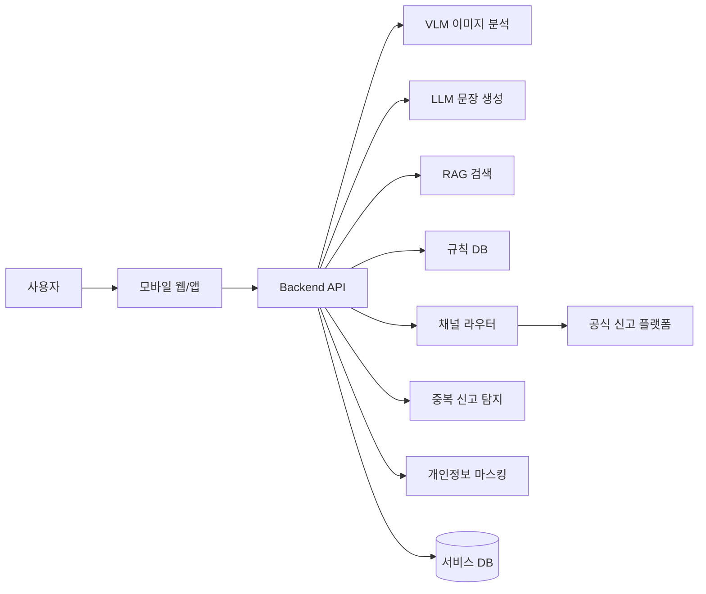
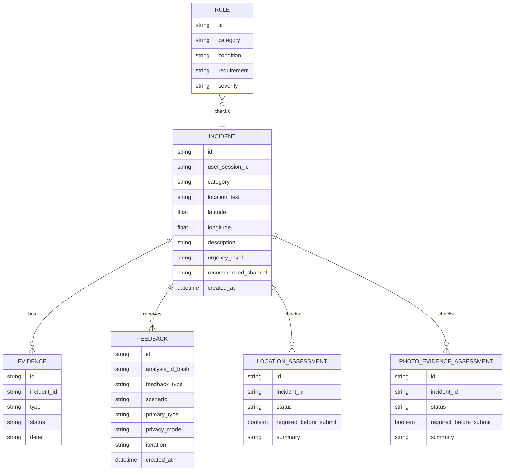
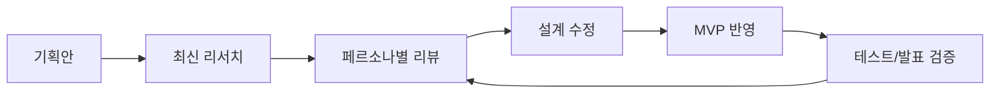

# Civic Copilot

생활민원 신고 전 검증을 위한 AI 코파일럿

- 과목: 소프트웨어프로젝트 I / AD 프로젝트
- 주제: AI를 활용한 지역사회 문제 해결
- 팀원: 김성빈, 정재훈
- 학교: 국민대학교 소프트웨어융합대학
- 학기: 2026학년도 1학기

---

## 1. 프로젝트 요약

Civic Copilot은 시민이 생활민원을 발견했을 때 신고 전에 필요한 판단을 AI가 도와주는 서비스이다. 사용자가 사진, 위치, 간단한 설명을 입력하면 AI가 민원 유형 후보, 신고 채널, 증거 요건, 긴급도, 개인정보 위험, 신고문 초안을 제안한다.

이 프로젝트는 안전신문고나 지자체 민원 앱을 대체하지 않는다. 기존 신고 플랫폼이 공식 접수와 처리 결과 확인을 담당하고, AI 안전신문고가 접수 후 분류와 이송 자동화에 가깝다면, Civic Copilot은 그보다 앞선 단계에서 시민이 접수 버튼을 누르기 전에 신고 성공 가능성을 높이는 "신고 전 AI 보조 레이어"이다.

AD 프로젝트의 목표가 실제 구현보다 AI/SW 개념 설계와 구현 가능성 검토에 있으므로, 본 보고서는 전체 시스템 설계를 상세히 제시하고, MVP 데모는 핵심 사용자 흐름을 검증하는 프로토타입으로 둔다.

## 2. 문제 정의

지역사회에는 보도블록 파손, 빗물받이 막힘, 쓰레기 무단투기, 가로등 고장, 불법주정차 같은 생활불편과 안전 문제가 반복적으로 발생한다. 이런 문제는 시민이 발견했을 때 빠르게 신고하면 해결 가능성이 높지만, 실제 사용자는 신고 전에 여러 장벽을 겪는다.

핵심 문제는 신고 플랫폼의 부재가 아니다. 안전신문고, 서울스마트 불편신고, 국민신문고, 120, 112, 119처럼 공식 채널은 이미 존재한다. 문제는 시민이 신고 전에 무엇을 어디에 어떻게 신고해야 하는지 판단해야 한다는 점이다.

| 문제 영역 | 사용자가 겪는 어려움 | 결과 |
|---|---|---|
| 신고 채널 혼란 | 안전신문고, 구청, 120, 112, 119 중 어디로 가야 할지 모름 | 신고 포기 또는 오접수 |
| 유형 선택 부담 | 도로, 교통, 시설물, 환경 등 분류가 복잡함 | 담당 부서 이관 지연 |
| 증거 요건 부족 | 사진, 위치, 시간, 번호판, 표지판 등 요건을 모름 | 반려 또는 재신고 |
| 문장 작성 부담 | 짧은 불편 설명을 행정 처리 가능한 문장으로 쓰기 어려움 | 부정확한 민원 |
| 긴급도 판단 실패 | 긴급 상황을 일반 민원으로 넣거나 반대로 과도하게 신고 | 대응 지연 또는 행정 부담 |
| 개인정보 위험 | 얼굴, 차량번호, 상세 주소가 사진에 포함될 수 있음 | 사생활 침해 위험 |
| 중복/반복 신고 | 이미 접수된 문제를 같은 내용으로 반복 신고할 수 있음 | 행정 처리 비효율 |

본 프로젝트의 문제 문장은 다음과 같다.

> 생활민원을 발견한 시민이 신고 절차, 증거 요건, 신고 채널, 작성 방법을 몰라 신고를 포기하거나 부정확하게 접수한다.

## 3. 목표와 범위

### 3.1 프로젝트 목표

Civic Copilot의 목표는 시민의 막연한 불편 제보를 행정 처리 가능한 신고 정보로 바꾸는 것이다.

구체적인 목표는 다음과 같다.

- 신고할지 말지 고민하는 시민에게 다음 행동을 제안한다.
- 신고 유형과 채널 선택 부담을 줄인다.
- 사진, 위치, 설명의 증거 충분성을 점검한다.
- 긴급 상황은 112/119 같은 공식 긴급 신고를 우선 안내한다.
- 사용자가 복사해 사용할 수 있는 신고문 초안을 생성한다.
- 개인정보와 허위 신고 위험을 줄인다.
- 유사 신고 가능성을 알려 중복 제출을 줄이되, 새 증거가 있으면 보완 정보로 정리한다.

### 3.2 범위

전체 설계는 VLM, LLM, RAG, 규칙 DB, 채널 라우터, 중복 신고 탐지, 개인정보 마스킹, 피드백 루프까지 포함한다.

MVP 데모는 실제 AI API를 붙이지 않고 rule/mock 기반으로 구성한다. MVP의 목적은 전체 AI 파이프라인의 핵심 사용자 경험을 검증하는 것이다.

## 4. 착안

대표 상황은 국민대 주변 대학가의 보도블록 파손이다. 사용자가 학교 앞 보도에서 깨진 보도블록을 발견했지만, 이걸 어디에 신고해야 하는지, 어떤 사진이 필요한지, 민원 문장을 어떻게 써야 하는지 몰라 지나치는 상황을 출발점으로 삼는다.

이 착안은 AD 프로젝트의 "지역사회 문제 해결" 조건에 부합한다. 대학가, 원룸촌, 골목길, 정류장, 학교 앞 보행로는 학생과 주민이 매일 사용하는 공간이고, 작은 생활불편이 안전 문제로 이어질 수 있다.

## 5. 조사

### 5.1 안전신문고

안전신문고는 행정안전부가 운영하는 범정부 안전신고 플랫폼이다. 공식 앱 설명에 따르면 안전, 불법주정차, 자동차/교통위반, 생활불편 분야 신고를 지원하며, 사진/동영상, 신고발생지역, 신고내용 입력으로 위험요인을 신고할 수 있다. 신고발생지역은 지도에서 선택하면 주소가 자동 변환되고, 스마트폰 GPS로 현재 위치를 선택할 수 있다.

불법주정차 신고는 특히 증거 요건이 엄격하다. 안전신문고 앱에서 촬영한 사진만 인정되고, 갤러리 사진은 이용할 수 없으며, 사진은 위변조 방지를 위해 암호화된다. 지자체의 불법주정차 주민신고제 안내에서도 동일 위치와 방향에서 일정 시간 간격을 둔 사진 2장 이상, 차량번호, 위반지역, 촬영시간 식별을 요구한다.

또한 안전신문고는 긴급한 화재, 구조, 구급은 119로, 치안은 112로 신고하라고 안내한다.

시사점은 명확하다. 공식 접수 창구, 사진/위치 입력, 긴급 신고 안내는 이미 존재한다. 따라서 Civic Copilot이 단순히 "사진으로 신고하는 앱"이면 차별성이 약하다. Civic Copilot은 사용자가 안전신문고에 접수하기 전에 사진이 충분한지, 위치와 증거가 명확한지, 긴급 신고가 우선인지 점검하는 앞단 보조 도구로 설계되어야 한다.

### 5.2 서울스마트 불편신고와 지자체 신고 앱

서울스마트 불편신고는 서울시 생활불편 신고 서비스이다. 공식 신고안내는 도로파손, 보도블록파손, 불법주정차, 쓰레기 무단투기, 다중이용시설 안전, 악취, 소음, 빛공해 등을 생활불편 신고 대상으로 안내한다. 서울시 응답소 현장민원 통계 설명에서도 교통, 도로, 청소 등 생활불편 민원이 서울스마트 불편신고 홈페이지, 스마트폰 앱, 120다산콜센터로 접수된다고 설명한다.

120다산콜재단은 외국어 상담에서 민원 신고와 정책 문의 등 서울시와 25개 자치구 행정 상담을 제공한다. 이는 생활민원 신고가 단일 앱 하나로 끝나지 않고, 지역·언어·상담 채널과 함께 운영된다는 점을 보여준다.

시사점은 지역별 채널과 규칙이 다르다는 점이다. 사용자는 안전신문고, 지자체 앱, 120, 구청 민원 중 어떤 채널이 맞는지 스스로 판단해야 한다. Civic Copilot의 채널 라우터와 지역별 규칙 DB가 필요한 이유가 여기에 있다.

또 하나의 시사점은 제출 경계다. 서울스마트 불편신고는 신고하기, 신고조회, 신고안내, 시민말씀지도 같은 공식 처리 기능을 제공하고, 안전신문고도 신고확인, 주요처리사례, 신고처리현황, 신고현황 지도, 안전신고 통계 기능을 제공한다. 따라서 Civic Copilot이 공식 접수와 처리 확인을 대신하면 기존 공공 시스템과 책임 경계가 충돌한다. MVP는 신고문을 복사하고 공식 채널을 여는 수준으로 제한하는 것이 적절하다.

### 5.3 국민신문고 생성형 AI

국민권익위원회는 2026년 2월부터 국민신문고로 접수되는 민원 데이터를 활용한 생성형 AI 기반 국민소통·민원분석 서비스를 개시했다. 주요 기능은 AI 민원답변 추천, 빈발·중복민원 일괄처리, AI 기반 민원분석이다. 시범 기관은 식품의약품안전처, 국토교통부, 인천광역시, 시흥시 등이다.

AI 민원답변 추천은 관련 법령, 기존 민원 사례, 업무 매뉴얼을 분석해 답변 초안을 작성하고 민원 담당자에게 제시한다. 빈발·중복민원 일괄처리는 동일·유사 민원을 자동 선별·군집화하여 한 번에 처리하도록 돕는다. AI 기반 민원분석은 단어 중심 분석을 넘어 민원의 맥락을 파악해 국민 생활 이슈를 포착하는 기능이다.

시사점은 AI가 민원 영역에 이미 도입되고 있다는 점이다. 다만 국민신문고 AI는 접수된 민원을 처리하는 행정 내부 효율화와 분석에 가깝다. 시민이 신고하기 전 단계에서 증거 요건, 채널, 긴급도, 신고문을 준비하도록 돕는 UX는 별도 설계 대상이다.

### 5.4 AI 안전신문고

LG AI연구원과 KETI는 행정안전부 AI 안전신문고 1단계 연구개발을 완료하고 2026년 중 시범 서비스를 준비 중이라고 밝혔다. 보도자료에 따르면 AI 안전신문고는 하루 3만 9천 건 이상, 연 1,000만 건 이상 규모의 안전 신고를 AI가 분석해 접수, 선별, 분류, 담당 부서 이관, 답변 회신까지 지능화·자동화하는 차세대 처리 시스템이다.

특히 비전언어모델은 사진과 영상을 포함한 안전 신고 내용을 선별하고 분류하는 역할을 맡는다. 예를 들어 막힌 빗물받이 사진을 올리면 AI가 사진을 분석해 신고 내용을 생성하고, 중요도가 높은 신고는 소관 기관 분류 단계를 줄여 조치 부서로 이송하는 구상이다.

이는 Civic Copilot과 가장 가까운 유사 사례다. 따라서 본 프로젝트의 차별점은 더 명확해야 한다. AI 안전신문고가 접수 후 분류·이송·답변 고도화에 가깝다면, Civic Copilot은 시민이 접수 버튼을 누르기 전 사진, 위치, 증거 요건, 개인정보, 긴급도, 신고문, 신고 채널을 검토하는 "접수 전 준비"에 집중한다.

### 5.5 개인정보와 접근성 조사

사진 기반 신고 보조 서비스는 생활민원 문제를 해결하는 동시에 개인정보 리스크를 만든다. 현장 사진에는 신고 대상과 무관한 보행자 얼굴, 차량번호, 상세 주소, 전화번호, 상가 간판, 거주지 정보가 함께 찍힐 수 있다. 특히 불법주정차처럼 차량번호가 증거인 유형에서는 "필요한 식별 정보"와 "불필요한 사생활 정보"를 구분해야 한다.

개인정보보호위원회는 AI 서비스 기획·설계 단계부터 Privacy by Design 원칙을 적용하고, 개인정보 수집, 이용·제공, 안전한 보관·관리, 파기, 투명한 공개, 권리행사 절차를 점검하도록 안내한다. 가명정보 제도 안내에서도 목적 설정, 위험성 검토, 가명처리, 적정성 검토, 안전한 관리 절차를 제시한다. 또한 AI 활용 수요가 커지는 영상·음성·텍스트 같은 비정형데이터는 식별 위험성 점검과 처리 방법이 중요하다고 설명한다.

따라서 Civic Copilot은 개인정보를 단순 주의 문구로 처리하지 않고 별도 모듈로 설계한다. 얼굴과 상세 주소는 마스킹 또는 최소화 대상이고, 차량번호는 불법주정차 신고에서는 증거로 유지하되 발표·공유 화면에서는 가릴 수 있어야 한다. 원본 사진은 분석과 사용자 확인에 필요한 기간만 보관하고, 모델 개선이나 통계 분석에는 비식별 또는 가명처리된 데이터만 사용하는 방향이 적절하다.

접근성 측면에서는 NIA의 디지털정보격차 실태조사가 고령층, 장애인, 저소득층, 농어민, 북한이탈주민, 결혼이민자 등 계층별 디지털 정보화 수준과 AI 서비스 관련 항목을 다룬다. 이는 Civic Copilot이 대학생/청년 시민만을 대상으로 끝나지 않고, 고령층과 외국인 주민도 사용할 수 있도록 쉬운 문장, 짧은 단계, 명확한 상태 라벨, 다국어 입력을 고려해야 한다는 근거가 된다.

### 5.6 중복 신고와 행정 부담 조사

중복 신고는 단순히 "사용자가 같은 내용을 여러 번 보낸다"는 UX 문제가 아니라 행정 처리 효율과 민원 서비스 품질에 직접 연결된다.

국민권익위원회의 2026년 국민신문고 AI 자료는 빈발·중복민원 일괄처리를 핵심 기능으로 설명한다. 보도자료에 따르면 이 기능은 국토교통부, 인천광역시, 시흥시를 대상으로 동일·유사 민원을 AI가 자동 선별하고 군집화하여 한 번에 처리할 수 있도록 돕는다. 이를 통해 반복 업무 시간을 줄이고 담당 공무원이 답변 내용을 검토할 시간을 확보하는 것이 목표다.

현행 민원 처리에 관한 법률 제23조도 반복 및 중복 민원 처리를 별도로 다룬다. 동일한 내용의 민원을 정당한 사유 없이 3회 이상 반복 제출한 경우, 행정기관은 2회 이상 처리결과를 통지한 뒤 그 후 접수되는 민원을 종결처리할 수 있다. 다만 동일 내용인지 여부는 민원의 성격, 종전 민원과의 내용적 유사성·관련성, 동일 답변 가능성 등을 종합적으로 고려해야 한다.

이 근거는 Civic Copilot의 설계 방향을 명확하게 만든다. 서비스가 사용자의 신고를 자동으로 막아서는 안 된다. 같은 위치의 같은 문제가 이미 접수되었더라도, 오늘 더 파손되었거나 새 사진이 있거나 위험 정도가 변했다면 행정 담당자에게 의미 있는 보완 정보가 될 수 있다. 따라서 중복 탐지는 차단 기능이 아니라 다음 세 가지를 안내하는 신고 품질 코칭으로 설계한다.

| 항목 | 설계 방향 |
|---|---|
| 유사 신고 확인 | 같은 위치와 유형의 기존 신고 가능성을 알려준다. |
| 보완 정보 추가 | 새 사진, 발생 시각, 위험 변화, 처리번호를 함께 적도록 안내한다. |
| 반복 제출 주의 | 같은 내용을 반복 제출하기보다 기존 신고 맥락에 새 근거를 붙이도록 안내한다. |

행정안전부 자체평가 자료도 대량 신고 환경을 보여준다. 안전신문고는 2014년 9월 30일부터 2024년 10월 31일까지 누계 32,106,011건의 신고가 있었고, 안전신문고와 스마트국민제보 처리기능 통합도 추진되었다. 신고량이 큰 환경에서는 신고 전 단계의 분류, 증거 보완, 중복 가능성 안내가 행정 부담을 줄이는 보조 장치가 될 수 있다.

### 5.7 피드백 루프 조사

국민신문고의 민원 처리 절차는 신청서 작성, 유사사례 검토, 처리기관 선택 및 제출, 접수, 처리, 완료 후 만족도 조사로 이어진다. 즉 공공 민원 흐름에도 제출 이후 사용자의 평가 신호가 존재한다. 다만 Civic Copilot은 공식 민원 처리 시스템이 아니므로 처리 결과를 대신 판정하거나 민원 원문을 개선 로그로 그대로 저장해서는 안 된다.

따라서 피드백 루프는 세 가지 선택형 신호로 제한한다.

| 신호 | 의미 | 저장 범위 |
|---|---|---|
| 신고문 도움됨 | 생성 문장이 공식 제출 준비에 도움이 되었는지 | 선택값, 시나리오, 추천 유형 |
| 보완 필요 | 유형, 채널, 증거 안내 중 수정이 필요한지 | 선택값, 시나리오, 추천 유형 |
| 공식 제출 완료 | 공식 채널 이동 후 실제 제출까지 이어졌는지 | 선택값, 시나리오, 추천 유형 |

위치, 신고문 원문, 사진 원본은 피드백 로그에 저장하지 않는다. 이 구조는 사용자에게 부담을 주지 않으면서도 추천 정확도, 신고문 유용성, 공식 제출 전환율을 개선하는 근거가 된다.

### 5.8 위치/증거 완성도 조사

행정안전부 안전신문고 안내는 안전위험요인을 발견하면 사진이나 동영상을 촬영한 후, 간단한 신고내용과 지도상 위치를 지정하여 제출한다고 설명한다. 국민신문고 민원 절차도 신청서 작성 단계에서 주소와 민원 내용을 포함한다.

이 근거는 위치 정보가 단순한 선택 입력이 아니라 담당 기관이 현장을 찾기 위한 핵심 증거라는 점을 보여준다. 사진이 선명하고 신고문이 좋아도 위치가 없으면 담당 부서가 현장 확인을 하기 어렵다. 따라서 Civic Copilot은 위치가 비어 있을 때 `현장 위치` 같은 임시 문구로 조용히 넘어가지 않고, 공식 제출 전 보완해야 할 상태로 표시한다.

MVP의 `위치/증거 완성도`는 다음 세 가지 행동을 안내한다.

| 행동 | 의미 |
|---|---|
| 지도 위치 지정 | 공식 채널에서 지도 핀 또는 GPS 위치를 실제 현장에 맞게 지정한다. |
| 주변 기준점 추가 | 건물명, 도로명 주소, 정류장, 가로등 번호처럼 찾기 쉬운 단서를 적는다. |
| 사진 배경 보완 | 파손 부위만 확대하지 않고 주변 간판, 도로 표지, 출입구가 보이는 사진을 추가한다. |

### 5.9 사진 증거 완성도 조사

행정안전부 안전신문고 업무안내는 안전위험요인을 발견하면 사진이나 동영상을 촬영한 뒤 신고내용과 지도상 위치를 지정해 제출한다고 설명한다. 이 근거를 기준으로 보면 사진 입력은 단순한 데모 장식이 아니라 공식 신고 준비의 핵심 입력이다.

따라서 Civic Copilot은 사진이 선택되지 않은 상태를 조용히 통과시키지 않는다. 위치가 없을 때 `위치/증거 완성도`가 보완 필요를 표시하듯, 사진이 없을 때도 `사진 증거 완성도`를 별도 상태로 표시한다.

MVP의 `사진 증거 완성도`는 다음 세 가지 행동을 안내한다.

| 행동 | 의미 |
|---|---|
| 현장 사진 추가 | 공식 제출 전 실제 현장 사진이나 동영상을 추가한다. |
| 전체 배경 사진 | 담당자가 현장을 찾을 수 있도록 주변 건물, 간판, 도로명 표지 등 위치 단서를 포함한다. |
| 근접 사진 | 파손, 막힘, 고장처럼 판단에 필요한 문제 부위를 선명하게 촬영한다. |

긴급 상황에서는 예외를 둔다. 화재, 감전, 범죄, 인명 피해 가능성이 있으면 사진 보완보다 안전 확보와 112/119 직접 신고가 우선이다.

### 5.10 쉬운 다음 단계와 상담 접근성 조사

NIA의 2025 디지털정보격차 실태조사 보고서는 고령층, 장애인, 저소득층, 농어민, 북한이탈주민, 결혼이민자 등 계층별 디지털 정보화 수준과 AI 서비스 관련 항목을 다룬다. 이는 생활민원 신고가 단순히 앱 기능의 문제가 아니라 디지털 접근성과도 연결된다는 점을 보여준다.

또한 120다산콜재단 외국어상담 안내는 평일 9:00-18:00에 영어, 중국어, 일본어, 베트남어, 몽골어 상담을 제공하며, 교통 정보, 수도 요금, 지방세, 민원 신고, 정책 문의 등 서울시와 25개 자치구 행정 상담을 제공한다고 설명한다. 상담에 필요한 경우 삼자간 통역도 제공한다.

따라서 Civic Copilot은 결과 화면을 전문적인 분석 카드로만 구성하면 안 된다. 디지털 취약 사용자와 외국인 주민에게는 다음 행동을 쉬운 순서로 다시 요약하고, 서울 지역에서는 120 외국어 상담 같은 사람 기반 상담 채널을 보조 경로로 제시해야 한다.

MVP의 `쉬운 다음 단계`는 다음 세 가지 행동을 안내한다.

| 행동 | 의미 |
|---|---|
| 사진과 위치 확인 | 현장 사진, 지도 위치, 주변 기준점이 빠졌는지 먼저 확인한다. |
| 신고문 복사 | 생성 문장을 읽고 사실과 다른 표현을 지운 뒤 복사한다. |
| 공식 채널에서 직접 제출 | 안전신문고나 지자체 신고 화면에서 사용자가 최종 제출한다. |

### 5.11 지역 채널 라우팅 조사

서울 스마트 불편신고는 생활 속 불편 신고, 신고조회, 시민말씀지도 기능을 제공하고, 생활불편신고 안내에서 도로파손, 보도블록파손, 쓰레기 무단투기, 불법주정차 등을 신고 대상으로 다룬다. 반면 안전신문고는 전국 단위 안전신고와 처리현황 확인을 담당한다.

이 차이는 채널 추천 설계에 중요하다. Civic Copilot이 모든 생활민원을 안전신문고로만 보내면 지역별 공식 창구와 상담 경로를 충분히 반영하지 못한다. 특히 국민대 주변처럼 서울 안의 생활불편 문제는 서울 스마트 불편신고를 1순위로 검토하고, 전국 단위 안전신고나 처리현황 확인은 안전신문고를 대안으로 둔다.

MVP의 `지역 채널 라우팅`은 다음 구조를 따른다.

| 위치/상황 | 1순위 | 대안 |
|---|---|---|
| 서울 생활불편 | 서울 스마트 불편신고 | 안전신문고, 120 다산콜 |
| 비서울 또는 지역 불명 | 안전신문고 | 관할 지자체 생활민원 |
| 긴급 상황 | 112/119 | 후속 생활민원 |

### 5.12 추천 근거와 설명가능성 조사

NIA 인공지능 사업추진 윤리원칙은 AI 사업을 기획하고 실행할 때 위험요인을 선제적으로 파악하고, 오남용 방지를 위한 책임을 다하며, 사회적 영향력을 고려해 개선에 반영해야 한다는 방향을 제시한다. Civic Copilot은 행정 판단을 대신하는 서비스가 아니므로, 사용자가 AI 추천을 공식 판단처럼 오해하지 않도록 근거와 한계를 같이 보여줘야 한다.

따라서 MVP에는 `추천 근거/불확실성` 모듈을 둔다. 이 모듈은 유형 추천, 채널 추천, 증거 보완, 자동 제출 금지의 근거를 한 곳에 묶고, AI 결과가 참고용이며 최종 확인은 사용자가 공식 채널에서 해야 한다고 고지한다.

| 설명 항목 | 의미 |
|---|---|
| 유형 추천 근거 | 입력 시나리오와 설명이 어떤 규칙에 의해 분류되었는지 표시 |
| 채널 추천 근거 | 지역 채널 라우팅의 1순위와 대안 채널 이유 표시 |
| 증거 보완 근거 | 위치, 사진, 식별 정보 부족 여부를 제출 전 보완 상태로 설명 |
| 자동 제출 금지 근거 | Civic Copilot의 책임 범위와 공식 채널의 역할 분리 |

### 5.13 조사 결론

기존 서비스와 관련 근거는 다음 영역으로 나뉜다.

| 구분 | 역할 | 한계 |
|---|---|---|
| 안전신문고/지자체 앱 | 공식 신고 접수, 사진/위치/내용 입력, 처리 결과 확인 | 사용자가 유형, 증거, 문장을 직접 판단 |
| 국민신문고 AI | 접수된 민원 답변 추천, 중복 민원 처리, 민원 분석 | 시민 앞단의 신고 준비 UX가 아님 |
| AI 안전신문고 | 안전 신고 접수 후 선별, 분류, 이송, 답변 자동화 | 접수 전 증거 보완과 사용자 코칭은 제한적 |
| 민원 빅데이터 API | 급증 키워드, 유사사례, 지역 순위 등 분석 정보 제공 | 개별 시민의 신고 준비 화면은 아님 |
| 개인정보/AI 가이드 | AI 서비스의 개인정보 보호, 가명처리, 비정형데이터 안전관리 원칙 제공 | 신고 사진의 얼굴, 차량번호, 상세 주소 처리 설계가 필요 |
| 민원처리법/행정 통계 | 반복·중복 민원 처리 근거와 대량 신고 운영 현실 확인 | 중복 탐지는 차단이 아니라 보완 정보 안내로 설계 |
| 국민신문고 처리 절차 | 유사사례 검토와 처리결과 만족도 평가 흐름 제공 | 피드백은 선택형·비식별 개선 루프로 제한 |
| 안전신문고/국민신문고 입력 절차 | 사진/동영상, 신고내용, 지도상 위치, 주소 작성 흐름 확인 | 위치 미입력은 공식 제출 전 보완 상태로 표시 |
| 안전신문고 사진/동영상 절차 | 사진이나 동영상이 신고 준비의 핵심 입력임을 확인 | 사진 미첨부는 공식 제출 전 보완 상태로 표시 |
| 디지털정보격차/외국어 상담 | 고령층·외국인 주민의 접근성 요구와 120 외국어 상담 확인 | 쉬운 다음 단계와 상담 연결을 별도 UX로 표시 |
| 서울 스마트 불편신고/안전신문고 | 지역 생활불편 채널과 전국 안전신고 채널의 역할 차이 확인 | 지역 채널 라우팅으로 1순위와 대안을 분리 |
| NIA AI 윤리원칙 | 위험요인 파악, 책임, 사회적 영향 고려 원칙 확인 | 추천 근거와 불확실성을 별도 UX로 표시 |
| Civic Copilot | 신고 전 검증, 작성, 라우팅, 안전/개인정보 경고 | 공식 접수 권한은 없음 |

따라서 Civic Copilot의 핵심 차별점은 다음 문장으로 정의한다.

> Civic Copilot은 기존 신고 플랫폼 앞단에서 시민이 신고 유형, 증거 요건, 긴급도, 문장 작성, 신고 채널을 미리 확인하도록 돕는 신고 전 AI 보조 레이어이다.

이 포지션은 기존 서비스와 충돌하지 않고 보완 관계를 만든다. 공식 접수는 안전신문고와 지자체 앱이 담당하고, 접수 후 행정 처리 자동화는 국민신문고 AI와 AI 안전신문고가 담당한다. Civic Copilot은 시민의 신고 준비 품질을 높이는 별도 계층으로 설계한다.

## 6. 사용자와 이해관계자

### 6.1 대표 사용자

대표 사용자는 국민대 주변을 다니는 대학생/청년 시민이다. 학교 앞 보도, 원룸촌 골목, 정류장 주변, 상가 앞 도로에서 생활불편을 자주 발견하지만 신고 경험이 적고 절차를 잘 모른다.

### 6.2 확장 사용자

| 사용자 | 문제 | 제공 가치 |
|---|---|---|
| 고령층 | 앱 사용과 민원 문장 작성이 어려움 | 쉬운 안내와 문장 생성 |
| 외국인 주민 | 한국어 신고문과 채널 이해가 어려움 | 다국어 입력과 한국어 신고문 생성 |
| 행정 담당자 | 오분류, 증거 부족, 중복 민원이 많음 | 접수 품질 개선 |

고령층과 외국인 주민은 부가 사용자라기보다 설계 품질을 확인하는 중요한 검토 관점이다. 이들이 이해할 수 있는 짧은 단계, 쉬운 라벨, 명확한 다음 행동이 제공되면 대학생/청년 사용자에게도 더 빠르고 안전한 UX가 된다.

## 7. 사용자 여정

### 7.1 현재 흐름

1. 시민이 지역 문제를 발견한다.
2. 사진을 찍을지 고민한다.
3. 어디에 신고해야 하는지 찾는다.
4. 신고 유형과 문장을 직접 선택한다.
5. 증거 요건을 몰라 신고가 반려되거나 이관된다.
6. 다음부터 신고를 포기할 가능성이 커진다.

### 7.2 Civic Copilot 적용 흐름

1. 시민이 사진, 위치, 한 줄 설명을 입력한다.
2. AI가 민원 유형 후보를 제안한다.
3. AI가 증거 요건과 사진 품질을 점검한다.
4. AI가 긴급 신고 여부를 판단한다.
5. AI가 신고 채널을 추천한다.
6. AI가 행정 처리 가능한 신고문 초안을 생성한다.
7. 사용자가 확인 후 공식 신고 플랫폼으로 이동하거나 문장을 복사한다.

## 8. 기능 요구사항

| ID | 요구사항 | 설명 |
|---|---|---|
| FR-001 | 사진 입력 | 현장 사진을 업로드하거나 촬영한다. |
| FR-002 | 위치 입력 | GPS 또는 수동 주소 입력을 지원한다. |
| FR-003 | 상황 설명 입력 | 사용자가 짧은 설명을 입력한다. |
| FR-004 | 민원 유형 추천 | Top-3 유형 후보와 신뢰도를 제공한다. |
| FR-005 | 신고 채널 추천 | 안전신문고, 구청/120, 112/119, 지역 앱을 추천한다. |
| FR-006 | 증거 체크리스트 | 사진, 위치, 시간, 번호판, 표지판 등 요건을 점검한다. |
| FR-007 | 긴급도 판단 | 긴급 위험 가능성을 감지하면 공식 긴급 신고를 안내한다. |
| FR-008 | 신고문 생성 | 행정 처리 가능한 문장 초안을 생성한다. |
| FR-009 | 개인정보 경고 | 얼굴, 차량번호, 상세 주소 등 민감정보를 경고한다. |
| FR-010 | 마스킹 제안 | 필요한 경우 사진 흐림 처리 후보를 제안한다. |
| FR-011 | 중복 가능성 안내 | 위치/유형/시간 기반 유사 신고 가능성을 알려주고 보완 정보를 안내한다. |
| FR-012 | 신고문 복사 | 사용자가 공식 앱에 붙여넣을 수 있게 한다. |
| FR-013 | 공식 채널 이동 | 추천 신고 채널을 열되 자동 제출하지 않고 사용자가 직접 확인·제출하게 한다. |
| FR-014 | 피드백 수집 | 선택형 비식별 피드백으로 추천 정확도와 신고문 품질을 개선한다. |
| FR-015 | 위치/증거 완성도 점검 | 위치가 비어 있으면 지도 위치, 주변 기준점, 배경 사진 보완을 안내한다. |
| FR-016 | 사진 증거 완성도 점검 | 사진이 없으면 현장 사진, 전체 배경 사진, 근접 사진 보완을 안내한다. |
| FR-017 | 쉬운 다음 단계 | 디지털 취약 사용자와 외국인 주민을 위해 제출 전 행동을 쉬운 순서로 요약한다. |
| FR-018 | 지역 채널 라우팅 | 서울 생활불편, 비서울/지역 불명, 긴급 상황에 따라 1순위와 대안 채널을 분리한다. |
| FR-019 | 추천 근거/불확실성 | AI 추천의 근거, 공식 출처, 한계, 사용자 최종 확인 경계를 표시한다. |

## 9. 비기능 요구사항

| ID | 요구사항 | 설명 |
|---|---|---|
| NFR-001 | 안전성 | 긴급 상황은 보수적으로 112/119를 안내한다. |
| NFR-002 | 설명 가능성 | 추천 이유와 근거를 함께 제공한다. |
| NFR-003 | 개인정보 보호 | 최소 수집, 저장 기간 제한, 로그 비식별화를 적용한다. |
| NFR-004 | 접근성 | 모바일 우선 UI와 쉬운 문장을 제공한다. |
| NFR-005 | 응답성 | 일반 분석은 수 초 내 완료를 목표로 한다. |
| NFR-006 | 확장성 | 지역별 규칙 DB를 추가할 수 있어야 한다. |
| NFR-007 | 신뢰성 | 자동 제출 없이 사용자 확인을 필수로 한다. |
| NFR-008 | 유지보수성 | 신고 규칙과 모델 로직을 분리한다. |

## 10. 시스템 아키텍처



### 10.1 클라이언트

클라이언트는 모바일 우선 UI이다. 현장에서 사진 촬영, 위치 확인, 간단한 설명 입력, 분석 결과 확인, 신고문 복사, 외부 신고 채널 이동을 담당한다.

### 10.2 백엔드 API

백엔드는 입력 데이터를 검증하고 AI 모듈을 순차 또는 병렬로 호출한다. 분석 결과를 통합해 클라이언트에 반환한다.

### 10.3 AI/규칙 계층

AI 계층은 VLM, LLM, RAG, 규칙 DB, 채널 라우터로 구성된다. VLM과 LLM은 유연한 해석과 생성에 쓰이고, 규칙 DB는 명시 요건을 안정적으로 검증한다.

## 11. AI 파이프라인 설계

### 11.1 입력

- 사진: 현장 이미지
- 위치: GPS 좌표 또는 주소
- 설명: 사용자의 한 줄 텍스트
- 선택 유형: 사용자가 직접 고른 예비 유형

### 11.2 VLM

VLM은 사진에서 다음 요소를 추출한다.

- 파손된 도로/보도/시설물
- 쓰레기 적치
- 차량과 번호판
- 표지판과 금지 구역 표시
- 전선, 화재, 연기 같은 위험 요소
- 얼굴, 차량번호 등 개인정보 후보

### 11.3 RAG와 규칙 DB

RAG는 안전신문고, 지자체 신고 안내, 불법주정차 요건, 긴급 신고 기준 같은 문서를 검색한다. 규칙 DB는 반복적으로 쓰이는 신고 요건을 구조화한다.

예시 규칙:

| 유형 | 필수/권장 요건 |
|---|---|
| 보도블록 파손 | 파손 부위 사진, 주변 위치 식별, 보행 위험 설명 |
| 불법주정차 | 차량번호, 금지 구역, 동일 위치 사진, 촬영 시간 |
| 빗물받이 막힘 | 배수시설 위치, 막힘 원인, 우천 시 위험 설명 |
| 가로등 고장 | 가로등 번호 또는 위치, 야간 사진 권장 |

불법주정차는 규칙 DB의 필요성을 가장 잘 보여주는 유형이다. 지역별 세부 기준은 다를 수 있지만, 공식 안내에서 반복적으로 등장하는 공통 요건은 다음과 같이 구조화할 수 있다.

| 규칙 항목 | MVP 표시 | 설계 의미 |
|---|---|---|
| 앱 촬영 사진 | 필수 | 위변조 방지와 공식 접수 요건 확인 |
| 동일 위치·각도 | 필수 | 차량이 이동하지 않았는지 판단 |
| 촬영 간격 | 필수 | 보통 1분 이상, 일부 구역은 5분 기준 가능 |
| 식별 정보 | 필수 | 차량번호, 위반지역, 촬영시간 확인 |
| 위반 구역 근거 | 권장 | 횡단보도, 버스정류소, 소화전, 보도 등 금지 구역 입증 |
| 신고 기한 | 참고 | 지자체별 신고 기한 차이를 지역 규칙 DB로 관리 |

### 11.4 채널 라우터

채널 라우터는 민원 유형, 위치, 긴급도, 증거 상태를 바탕으로 추천 채널을 정한다.

- 긴급 위험: 112 또는 119 우선
- 안전/생활불편: 안전신문고
- 지자체 생활민원: 구청, 120, 지역 앱
- 불법주정차: 안전신문고 또는 지자체 교통 신고

### 11.5 LLM

LLM은 사용자의 짧은 설명을 행정 처리 가능한 신고문으로 바꾼다. 다만 없는 사실을 만들어내지 않도록 입력된 위치, 사진 분석 결과, 규칙 DB 근거 안에서만 작성한다.

예시:

- 입력: "학교 앞 보도블록 깨져서 넘어질 뻔함"
- 출력: "국민대학교 정문 인근 보도블록이 파손되어 보행자가 걸려 넘어질 위험이 있습니다. 현장 확인 및 보수를 요청드립니다."

### 11.6 중복 신고 탐지

중복 신고 탐지는 위치, 유형, 시간, 이미지 유사도, 텍스트 유사도를 이용한다. 시민에게 신고를 막는 방식이 아니라, 이미 유사 신고가 있을 수 있음을 알려 보완 정보 제공을 유도한다.

중복 판단은 다음 신호를 조합한다.

| 신호 | 설명 |
|---|---|
| 유사 위치 | 같은 반경 안에서 같은 유형의 최근 신고가 있는지 확인 |
| 동일 유형 | 보도블록, 빗물받이, 불법주정차 등 문제 유형이 같은지 확인 |
| 시간 근접성 | 같은 기간에 반복 접수되는지 확인 |
| 이미지 유사도 | 같은 파손 부위나 차량처럼 시각적으로 같은 대상인지 확인 |
| 텍스트 유사도 | 신고문 내용이 기존 신고와 의미상 유사한지 확인 |
| 새 위험 정보 | 악화, 추가 파손, 사고 발생처럼 새 근거가 있는지 확인 |

결과 표현은 세 단계로 둔다.

| 결과 | 사용자 안내 |
|---|---|
| 중복 가능성 낮음 | 그대로 신고 준비를 계속한다. |
| 확인 필요 | 같은 위치의 기존 신고가 있을 수 있으니 새 정보가 있는지 확인한다. |
| 중복 가능성 높음 | 기존 신고를 확인하고 새 사진, 발생 시각, 위험 변화, 처리번호를 함께 적도록 안내한다. |

중요한 원칙은 `중복 가능성 높음`이어도 제출을 차단하지 않는다는 점이다. 민원처리법상 반복·중복 민원 판단은 행정기관이 민원의 성격과 종전 민원과의 유사성, 동일 답변 가능성 등을 종합해 처리해야 한다. Civic Copilot은 공식 판단자가 아니므로, 사용자의 신고권을 막지 않고 행정 담당자가 새 정보의 가치를 판단할 수 있게 신고문 품질을 높인다.

### 11.7 개인정보 마스킹

개인정보 모듈은 얼굴, 차량번호, 상세 주소, 전화번호, 사생활 침해 가능성이 있는 요소를 감지하고 경고한다. 제출 전 사용자가 직접 확인하고 필요하면 흐림 처리한다.

개인정보 판단은 "전부 가리기"가 아니라 신고 목적에 필요한 정보와 불필요한 정보를 구분하는 방식으로 설계한다.

| 항목 | 판단 | 처리 |
|---|---|---|
| 사람 얼굴 | 신고 대상과 직접 관련 없는 경우가 많음 | 마스킹 또는 촬영 각도 조정 |
| 차량번호 | 불법주정차에서는 공식 증거가 될 수 있음 | 공식 제출본에서는 유지, 공유/발표 화면에서는 가림 |
| 상세 주소/거주지 | 위치 확인 범위를 넘으면 사생활 침해 가능 | 세부 호수, 연락처, 거주지 식별 정보 제거 |
| 원본 사진 | 분석과 사용자 확인에는 필요하지만 장기 보관 위험 | 필요한 기간만 보관 후 삭제 |
| 개선용 로그 | 모델/규칙 개선에는 유용하지만 원본 보관은 위험 | 얼굴, 차량번호, 상세 주소 제거 또는 비식별화 |

이 모듈은 MVP에서 `개인정보/마스킹 점검`으로 표현한다. 예를 들어 "차량번호가 보이고 사람 얼굴과 집 주소 간판이 같이 나와요"라는 입력이 들어오면 사람 얼굴은 마스킹, 차량번호는 신고 증거 유지, 상세 주소는 최소화 대상으로 분리해 안내한다.

### 11.8 공식 채널 handoff

공식 채널 handoff는 Civic Copilot이 어디까지 돕고 어디서 멈춰야 하는지를 정하는 경계 모듈이다. Civic Copilot은 신고문과 증거 체크를 만들 수 있지만 공식 신고를 자동 제출하지 않는다. 사용자는 결과를 확인한 뒤 안전신문고, 서울스마트 불편신고, 120 같은 공식 채널에서 직접 제출하거나 상담해야 한다.

MVP의 handoff는 다음 구조로 표현한다.

| 항목 | 설명 |
|---|---|
| 신고문 복사 | 생성 문장을 복사하되 과장되거나 확인되지 않은 표현을 제거한다. |
| 사진/위치 확인 | 공식 채널에서 요구하는 사진, 위치, 시간, 식별 정보를 다시 확인한다. |
| 공식 채널에서 직접 제출 | 추천 링크를 열고 사용자가 최종 내용과 제출 여부를 직접 결정한다. |

위치가 서울이면 서울 스마트 불편신고와 120 다산콜을 보조 채널로 제안할 수 있다. 특히 외국인 주민이나 신고 채널을 확신하지 못하는 사용자는 외국어 상담을 통해 행정 상담을 먼저 받을 수 있다.

### 11.9 위치/증거 완성도

위치/증거 완성도 모듈은 신고문 생성 전에 입력 위치가 실제 제출 가능한 수준인지 점검한다. 위치가 있으면 지도 핀과 주변 기준점 확인을 안내하고, 위치가 없으면 공식 제출 전 보완 필요 상태로 표시한다.

이 모듈은 위치를 강제로 수집하는 기능이 아니다. 사용자가 위치를 입력하지 않은 상태에서도 신고문 초안은 만들 수 있지만, 초안에는 "위치가 아직 입력되지 않았습니다"라는 문구와 위치 보완 요청을 포함한다. 이렇게 해야 데모가 사용자의 누락을 숨기지 않고 신고 품질을 개선하는 방향으로 동작한다.

| 상태 | UI 표시 | 신고문 처리 |
|---|---|---|
| 위치 있음 | 확인 완료 | 입력 위치를 포함해 신고문 생성 |
| 위치 없음 | 보완 필요 | 위치 미입력 문구와 지도상 위치 추가 요청 포함 |
| 긴급 상황 | 현재 위치 직접 전달 | 앱 입력보다 112/119에 현재 위치를 직접 알리도록 안내 |

### 11.10 사진 증거 완성도

사진 증거 완성도 모듈은 사진 입력이 실제로 선택되었는지 확인하고, 없을 경우 공식 제출 전 보완 필요 상태로 표시한다. 데모 화면에는 샘플 배경 이미지가 보이지만, 샘플 이미지는 신고 증거가 아니다. 따라서 시스템은 실제 파일 선택 여부를 별도 입력값으로 보내고, 사진이 없으면 `현장 사진 추가`, `전체 배경 사진`, `근접 사진`을 안내한다.

| 상태 | UI 표시 | handoff 처리 |
|---|---|---|
| 사진 있음 | 확인 완료 | 공식 채널에서 사진과 위치를 최종 확인 |
| 사진 없음 | 보완 필요 | 공식 제출 전 확인 목록에 사진 첨부 추가 |
| 긴급 상황 | 안전 우선 | 사진 촬영보다 112/119 직접 신고 우선 |

이 모듈은 AD 프로젝트의 "구현 가능성"을 보여주는 좋은 예시다. 실제 VLM을 붙이지 않아도 사진 유무와 공식 제출 요건을 분리하면, 향후 VLM이 사진 품질과 구도를 평가할 위치가 명확해진다.

### 11.11 쉬운 다음 단계

쉬운 다음 단계 모듈은 분석 결과를 모두 읽지 못하는 사용자도 다음 행동을 놓치지 않게 만드는 접근성 모듈이다. 결과 화면의 하단에서 `사진과 위치 확인`, `신고문 복사`, `공식 채널에서 직접 제출`을 3단계로 다시 보여준다.

서울 위치가 입력되면 120 외국어 상담을 보조 채널로 제시한다. 외국인 주민이나 신고 채널을 확신하지 못하는 사용자는 앱에서 바로 제출하기보다 상담을 먼저 이용하는 편이 안전할 수 있기 때문이다.

| 사용자 | 설계 반영 |
|---|---|
| 디지털 취약 사용자 | 행정 용어보다 행동 중심의 짧은 3단계 안내 |
| 외국인 주민 | 서울 지역에서 120 외국어 상담 연결 |
| 긴급 상황 사용자 | 쉬운 단계도 112/119 직접 신고를 우선 |

### 11.12 지역 채널 라우팅

지역 채널 라우팅 모듈은 추천 채널을 하나로 고정하지 않고, 위치와 상황에 따라 1순위와 대안을 나눈다. 서울 생활불편 신고는 서울 스마트 불편신고를 1순위로 보여주고, 안전신문고와 120 다산콜을 대안으로 보여준다. 지역이 불명확하거나 비서울이면 안전신문고를 기본 경로로 두되, 관할 지자체 생활민원 창구를 함께 확인하도록 안내한다.

| 입력 | 1순위 | 대안 |
|---|---|---|
| 서울 + 보도블록 파손 | 서울 스마트 불편신고 | 안전신문고, 120 다산콜 |
| 서울 + 쓰레기 무단투기 | 서울 스마트 불편신고 | 안전신문고, 120 다산콜 |
| 지역 불명 | 안전신문고 | 관할 지자체 생활민원 |
| 긴급 키워드 포함 | 112/119 | 후속 생활민원 |

이 모듈은 향후 `channel_directory`와 `jurisdiction_rules` DB로 확장할 수 있다. AD 프로젝트 단계에서는 서울과 전국 기본 경로만 rule/mock으로 보여준다.

### 11.13 추천 근거/불확실성

추천 근거/불확실성 모듈은 AI 결과의 설명가능성을 높이는 장치다. Civic Copilot은 추천 유형, 채널, 증거 보완, 신고문을 제안하지만, 이 결과가 공식 행정 판단은 아니다. 따라서 결과 화면에서 "왜 이렇게 추천했는가"와 "어디까지 사용자가 확인해야 하는가"를 함께 보여준다.

| 항목 | 설명 |
|---|---|
| 유형 추천 근거 | 시나리오, 설명, 규칙 DB 기준 |
| 채널 추천 근거 | 지역 채널 라우팅의 1순위와 대안 |
| 증거 보완 근거 | 사진/위치/식별 정보의 누락 여부 |
| 자동 제출 금지 근거 | 공식 접수와 처리 확인은 공식 채널에서 수행 |

이 모듈의 핵심 문구는 "AI 결과는 참고용이며, 최종 신고 내용과 제출 여부는 사용자가 공식 채널에서 확인한다"이다. 이는 안전장치 문구가 아니라 시스템 책임 경계를 드러내는 설계 요소다.

### 11.14 피드백 루프

피드백 루프는 MVP가 단순 화면 시연에서 끝나지 않고 설계 개선 도구로 동작하게 만드는 모듈이다. 사용자가 분석 결과를 본 뒤 "신고문 도움됨", "보완 필요", "공식 제출 완료" 중 하나를 선택하면, 시스템은 선택값과 시나리오 수준의 정보만 저장한다.

이 모듈의 핵심은 수집 범위를 줄이는 것이다. 위치, 신고문 원문, 사진 원본은 피드백 로그에 저장하지 않는다. 신고 성공 여부를 정확히 추적하려고 공식 계정 연동이나 민원 처리번호를 요구하면 MVP의 책임 범위가 공식 접수 시스템으로 넘어간다. 따라서 AD 프로젝트 단계에서는 피드백을 제품 개선 신호로만 다룬다.

| 항목 | 설계 |
|---|---|
| 수집 | 선택형 피드백, 시나리오, 추천 유형, 반복 버전 |
| 미수집 | 위치 원문, 신고문 원문, 사진 원본, 민원 처리번호 |
| 활용 | 추천 정확도, 신고문 유용성, 공식 제출 전환율 개선 |
| 근거 | 국민신문고의 유사사례 검토와 처리결과 만족도 조사 흐름 |

## 12. 데이터 모델



## 13. API 설계

### 13.1 사건 분석 요청

`POST /api/analyze`

요청:

```json
{
  "scenario": "sidewalk",
  "location": "국민대학교 정문 앞 보도",
  "description": "보도블록이 깨져서 넘어질 뻔했어요",
  "photoIds": ["photo_001"]
}
```

응답:

```json
{
  "primaryType": {
    "label": "보도블록 파손",
    "category": "도로 / 보행 안전",
    "confidence": 0.86
  },
  "typeCandidates": [
    { "label": "보도블록 파손", "confidence": 86 },
    { "label": "보행 안전 위험", "confidence": 68 },
    { "label": "생활불편 신고", "confidence": 51 }
  ],
  "recommendedChannel": {
    "name": "안전신문고 또는 구청 생활민원",
    "reason": "보행 안전과 관련된 시설물 파손입니다."
  },
  "urgency": {
    "level": "주의",
    "reason": "즉시 긴급 신고보다는 생활민원 접수 전 확인이 적합합니다."
  },
  "evidenceChecks": [
    { "label": "현장 사진 첨부", "status": "required", "detail": "공식 제출 전 현장 사진을 추가해야 합니다." },
    { "label": "파손 부위 식별", "status": "passed", "detail": "파손 범위가 보이도록 촬영합니다." },
    { "label": "주변 위치 식별", "status": "recommended", "detail": "건물명이나 도로 표지가 함께 보이면 좋습니다." }
  ],
  "duplicateAssessment": {
    "riskLevel": "중복 가능성 높음",
    "blocksSubmission": false,
    "actions": [
      { "label": "유사 신고 확인", "detail": "공식 채널의 유사 사례나 처리번호를 확인합니다." },
      { "label": "보완 정보 추가", "detail": "새 사진, 발생 시각, 위험 변화를 추가합니다." }
    ]
  },
  "officialHandoff": {
    "canAutoSubmit": false,
    "primaryAction": { "label": "공식 채널 열기", "url": "https://www.safetyreport.go.kr/" },
    "checklist": [
      { "label": "신고문 복사", "detail": "생성된 신고문을 복사합니다." },
      { "label": "사진 첨부", "detail": "공식 제출 전 현장 사진이나 동영상을 추가합니다." },
      { "label": "사진/위치 확인", "detail": "공식 채널에서 사진과 위치를 다시 확인합니다." },
      { "label": "공식 채널에서 직접 제출", "detail": "사용자가 최종 제출 여부를 결정합니다." }
    ]
  },
  "locationAssessment": {
    "status": "missing",
    "requiredBeforeSubmit": true,
    "summary": "공식 신고는 사진과 설명만으로 끝나지 않고 지도상 위치나 주소가 필요합니다.",
    "actions": [
      { "label": "지도 위치 지정", "detail": "공식 채널에서 지도 핀을 실제 현장에 맞게 지정합니다." },
      { "label": "주변 기준점 추가", "detail": "건물명, 도로명 주소, 정류장 같은 기준점을 적습니다." },
      { "label": "사진 배경 보완", "detail": "주변 표지나 간판이 보이는 사진을 추가합니다." }
    ]
  },
  "photoEvidenceAssessment": {
    "status": "missing",
    "requiredBeforeSubmit": true,
    "summary": "안전신문고는 사진이나 동영상, 신고내용, 지도상 위치를 함께 제출하도록 안내합니다.",
    "actions": [
      { "label": "현장 사진 추가", "detail": "공식 제출 전 실제 현장 사진이나 동영상을 추가합니다." },
      { "label": "전체 배경 사진", "detail": "주변 건물, 간판, 도로명 표지를 포함합니다." },
      { "label": "근접 사진", "detail": "문제 부위가 선명한 근접 사진을 준비합니다." }
    ]
  },
  "accessibilityGuide": {
    "summary": "보도블록 파손 신고 준비를 쉬운 순서로 정리합니다.",
    "steps": [
      { "label": "사진과 위치 확인", "detail": "현장 사진, 지도 위치, 주변 기준점이 빠졌는지 확인합니다." },
      { "label": "신고문 복사", "detail": "사실과 다른 표현이 있으면 지운 뒤 복사합니다." },
      { "label": "공식 채널에서 직접 제출", "detail": "사용자가 최종 내용을 확인하고 제출합니다." }
    ],
    "supportChannels": [
      { "label": "120 외국어 상담", "detail": "평일 9:00-18:00에 서울 행정 상담을 외국어로 받을 수 있습니다." }
    ]
  },
  "regionalChannelGuide": {
    "region": "서울",
    "primary": { "label": "서울 스마트 불편신고", "url": "https://smartreport.seoul.go.kr/" },
    "summary": "서울 스마트 불편신고는 도로파손, 보도블록파손, 쓰레기 무단투기 같은 생활불편 신고 대상을 안내합니다.",
    "options": [
      { "label": "서울 스마트 불편신고", "detail": "서울 지역 생활불편 신고와 처리 조회에 적합합니다." },
      { "label": "안전신문고", "detail": "전국 단위 안전 위험 신고와 처리현황 확인에 적합합니다." },
      { "label": "120 다산콜", "detail": "채널이 헷갈리거나 상담이 필요할 때 사용합니다." }
    ]
  },
  "explanationTrace": {
    "riskNotice": "AI 결과는 참고용입니다. 추천 유형, 채널, 신고문, 증거 요건은 사용자가 공식 채널에서 최종 확인해야 합니다.",
    "items": [
      { "label": "유형 추천 근거", "detail": "선택한 시나리오와 설명을 보도블록 파손 유형 규칙에 맞춰 분류했습니다." },
      { "label": "채널 추천 근거", "detail": "서울 기준 1순위는 서울 스마트 불편신고입니다." },
      { "label": "증거 보완 근거", "detail": "현장 사진이 부족하므로 공식 제출 전 보완 필요로 표시했습니다." },
      { "label": "자동 제출 금지 근거", "detail": "공식 접수와 처리 확인은 사용자가 공식 채널에서 수행합니다." }
    ],
    "sources": [
      { "label": "NIA 인공지능 사업추진 윤리원칙" },
      { "label": "행정안전부 안전신문고 업무안내" },
      { "label": "서울 스마트 불편신고 안내" }
    ]
  },
  "feedbackLoop": {
    "privacyMode": "anonymous-choice-only",
    "notice": "선택형 피드백만 저장하고 위치나 신고문 원문은 저장하지 않습니다.",
    "options": [
      { "label": "신고문 도움됨", "value": "draft_useful" },
      { "label": "보완 필요", "value": "needs_revision" },
      { "label": "공식 제출 완료", "value": "submitted_officially" }
    ]
  },
  "draft": "국민대학교 정문 앞 보도블록이 파손되어 보행자가 걸려 넘어질 위험이 있습니다. 현장 확인 및 보수를 요청드립니다.",
  "safetyNotice": "긴급한 화재, 구조, 구급, 범죄 상황은 공식 긴급 신고 채널을 먼저 이용하세요."
}
```

### 13.2 피드백 제출

`POST /api/feedback`

사용자가 선택한 피드백 값을 저장한다. 위치, 신고문 원문, 사진 원본은 피드백 요청에 넣지 않는다. 이 데이터는 비식별화 후 규칙 개선과 문장 품질 평가에 사용한다.

MVP 데모에서는 서버 API 대신 브라우저 로컬 저장소에 같은 구조로 최대 10건만 저장한다. 실제 서비스에서는 기관 협약과 개인정보 영향 검토 이후 서버 API로 전환할 수 있다.

요청:

```json
{
  "feedbackType": "draft_useful",
  "scenario": "sidewalk",
  "primaryType": "보도블록 파손",
  "iteration": "cycle-06"
}
```

응답:

```json
{
  "status": "OK",
  "privacyMode": "anonymous-choice-only"
}
```

## 14. MVP 설계

MVP는 전체 시스템 중 사용자가 체감하는 핵심 흐름을 검증한다. 실제 AI API는 붙이지 않고 rule/mock 기반으로 구현한다.

### 14.1 MVP 기능

- 모바일 우선 화면
- 샘플 민원 선택
- 위치/설명 입력
- 분석 버튼
- 유형 후보 Top-3
- 신고 채널 추천
- 증거 체크리스트
- 개인정보/마스킹 점검
- 위치/증거 완성도
- 사진 증거 완성도
- 지역 채널 라우팅
- 추천 근거/불확실성
- 쉬운 다음 단계
- 중복/행정 부담 점검
- 긴급도 안내
- 복사 가능한 신고문
- 공식 제출 전 확인
- 피드백 루프
- 최근 분석 이력

### 14.2 MVP 성공 기준

MVP는 사용자 흐름, 설계 타당성, 발표 설득력을 동시에 검증해야 한다.

| 기준 | 성공 조건 |
|---|---|
| 사용자 흐름 | 입력부터 신고문 복사까지 한 번에 이해 가능 |
| 설계 타당성 | 전체 AI/SW 설계의 핵심 데이터 흐름을 화면으로 확인 가능 |
| 발표 설득력 | "구현 가능한 설계"라는 점을 짧게 보여줄 수 있음 |

### 14.3 반복 검토 루프

MVP는 단순한 보너스 구현이 아니라 설계 검증 도구이다. 따라서 기획안 작성 후 최신 리서치를 반영하고, 서로 다른 페르소나 관점에서 리뷰한 뒤 설계와 데모를 수정하는 반복 루프를 둔다.



첫 번째 반복에서는 대학생 시민, 디지털 취약 사용자, 외국인 주민, 행정 담당자, 안전/윤리 검토자 관점으로 MVP를 검토했다.

| 관점 | 리뷰 질문 | 설계 반영 |
|---|---|---|
| 대학생 시민 | 현장에서 빠르게 신고 준비를 끝낼 수 있는가 | 입력 항목을 사진, 위치, 한 줄 설명 중심으로 유지 |
| 디지털 취약 사용자 | 행정 용어 없이 다음 행동을 알 수 있는가 | 증거 상태를 충족/권장/필수/참고 라벨로 표시 |
| 외국인 주민 | 한국어 민원 작성 부담을 줄일 수 있는가 | 장기 확장 요구사항에 다국어 입력과 한국어 신고문 생성을 포함 |
| 행정 담당자 | 오분류와 증거 부족 민원을 줄이는가 | 주변 위치 사진 권장과 유형/채널 근거 표시 |
| 안전/윤리 검토자 | 긴급상황과 개인정보 위험을 보수적으로 다루는가 | 112/119 우선 안내와 개인정보 경고를 결과에 포함 |

이 반복 기록은 `reviews/cycle-01-multi-perspective-review.md`에 별도 보관한다.

두 번째 반복은 불법주정차를 기준으로 규칙 DB 설계를 검토했다. 공식 자료에서 공통적으로 확인되는 사진 2장, 동일 위치·각도, 1분 간격, 차량번호·위반지역·촬영시간 식별 요건을 MVP에 `규칙 기반 요건`으로 추가했다. 이 반복 기록은 `reviews/cycle-02-parking-rule-review.md`에 별도 보관한다.

세 번째 반복은 개인정보와 접근성 리스크를 기준으로 검토했다. 개인정보보호위원회 자료를 바탕으로 얼굴, 차량번호, 상세 주소를 하나의 경고로 묶지 않고 각각 다른 처리 원칙을 부여했다. 또한 디지털정보격차 실태조사를 반영해 쉬운 문장, 짧은 단계, 명확한 라벨이 단순 UX 취향이 아니라 접근성 요구사항임을 정리했다. 이 반복 기록은 `reviews/cycle-03-privacy-accessibility-review.md`에 별도 보관한다.

네 번째 반복은 중복 신고와 행정 부담을 기준으로 검토했다. 국민신문고 AI의 빈발·중복민원 일괄처리, 민원처리법의 반복·중복 민원 처리 구조, 안전신문고의 대량 신고 운영 자료를 근거로 중복 탐지를 "신고 차단"이 아니라 "유사 신고 확인과 보완 정보 안내"로 재정의했다. MVP에는 `중복/행정 부담 점검`을 추가해 유사 위치, 동일 유형, 반복 표현, 새로운 위험 정보 신호와 세 가지 행동 안내를 보여준다. 이 반복 기록은 `reviews/cycle-04-duplicate-admin-burden-review.md`에 별도 보관한다.

다섯 번째 반복은 공식 채널 이동과 제출 경계를 기준으로 검토했다. 안전신문고와 서울스마트 불편신고가 공식 신고, 신고조회, 처리현황을 담당한다는 점을 반영해 MVP에 `공식 제출 전 확인`을 추가했다. 이 섹션은 신고문 복사, 사진/위치 확인, 공식 채널에서 사용자 직접 제출을 안내하고, 자동 제출하지 않는다는 문구를 명시한다. 이 반복 기록은 `reviews/cycle-05-official-channel-handoff-review.md`에 별도 보관한다.

여섯 번째 반복은 피드백 루프를 기준으로 검토했다. 국민신문고 민원 절차의 유사사례 검토와 처리결과 만족도 조사 흐름을 참고하되, Civic Copilot은 공식 처리 시스템이 아니므로 선택형 피드백만 익명 저장하도록 제한했다. MVP에는 `피드백 루프`를 추가해 신고문 도움됨, 보완 필요, 공식 제출 완료를 선택할 수 있게 하고, 위치나 신고문 원문은 저장하지 않는다는 경계를 명시했다. 이 반복 기록은 `reviews/cycle-06-feedback-loop-review.md`에 별도 보관한다.

일곱 번째 반복은 위치/증거 완성도를 기준으로 검토했다. 행정안전부 안전신문고 안내의 지도상 위치 지정, 국민신문고 민원신청서의 주소 작성 흐름을 근거로 위치 미입력을 별도 보완 상태로 다뤘다. MVP에는 `위치/증거 완성도`를 추가해 지도 위치 지정, 주변 기준점 추가, 사진 배경 보완을 안내한다. 이 반복 기록은 `reviews/cycle-07-location-evidence-review.md`에 별도 보관한다.

여덟 번째 반복은 사진 증거 완성도를 기준으로 검토했다. 행정안전부 안전신문고 업무안내는 사진이나 동영상을 촬영한 뒤 신고내용과 지도상 위치를 제출하도록 설명하므로, 사진 미첨부는 단순 UI 누락이 아니라 공식 제출 전 증거 부족 상태다. MVP에는 `사진 증거 완성도`를 추가해 현장 사진 추가, 전체 배경 사진, 근접 사진을 안내하고, 공식 제출 전 확인 목록에 사진 첨부를 추가한다. 이 반복 기록은 `reviews/cycle-08-photo-evidence-review.md`에 별도 보관한다.

아홉 번째 반복은 디지털 취약 사용자와 외국인 주민 관점으로 다시 검토했다. NIA 디지털정보격차 실태조사와 120다산콜재단 외국어상담 안내를 근거로, 결과 화면에 `쉬운 다음 단계`를 추가했다. 이 섹션은 분석 결과를 3단계 행동으로 다시 요약하고, 서울 지역에서는 120 외국어 상담을 보조 경로로 보여준다. 이 반복 기록은 `reviews/cycle-09-accessibility-support-review.md`에 별도 보관한다.

열 번째 반복은 지역 채널 라우팅을 기준으로 검토했다. 서울 스마트 불편신고가 도로파손, 보도블록파손, 쓰레기 무단투기 같은 생활불편 신고 대상을 안내하고, 안전신문고가 전국 단위 안전신고와 처리현황을 담당한다는 점을 반영했다. MVP에는 `지역 채널 라우팅`을 추가해 서울 생활불편은 서울 스마트 불편신고를 1순위로, 안전신문고와 120 다산콜을 대안으로 보여준다. 이 반복 기록은 `reviews/cycle-10-regional-channel-routing-review.md`에 별도 보관한다.

열한 번째 반복은 AI 추천의 투명성과 설명가능성을 기준으로 검토했다. NIA 인공지능 사업추진 윤리원칙의 위험요인 파악, 책임, 사회적 영향 고려 방향을 참고해, MVP에 `추천 근거/불확실성`을 추가했다. 이 섹션은 유형 추천 근거, 채널 추천 근거, 증거 보완 근거, 자동 제출 금지 근거를 한 곳에 모으고 AI 결과가 참고용임을 명시한다. 이 반복 기록은 `reviews/cycle-11-explainability-review.md`에 별도 보관한다.

열두 번째 반복은 확정 기획 기준 재조사를 수행했다. 2026년 기준 국민신문고 AI와 AI 안전신문고가 접수 후 답변, 중복 처리, 분류, 이송, 분석을 고도화하는 방향임을 다시 확인했고, Civic Copilot의 차별점이 "접수 전 시민 코칭"이라는 점을 재검증했다. 동시에 개인정보보호위원회 자료를 기준으로 피드백뿐 아니라 최근 분석 이력도 원문 위치와 신고문을 저장하지 않는 방향으로 보강해야 한다는 다음 설계 과제를 도출했다. 이 반복 기록은 `research/confirmed-plan-reresearch-2026-05-25.md`와 `reviews/cycle-12-confirmed-plan-reresearch-review.md`에 별도 보관한다.

열세 번째 반복은 로컬 이력과 데이터 보관 통제를 기준으로 검토했다. MVP의 최근 분석 이력이 상세 위치를 그대로 저장할 수 있다는 점을 개인정보 최소화 관점에서 수정했다. 최근 분석은 `서울 지역`, `지역 확인 필요`, `위치 미입력` 같은 지역 수준 라벨과 유형, 채널, 긴급도만 브라우저에 저장하며, 신고문 원문과 상세 위치는 저장하지 않는다. 또한 삭제 버튼이 이 브라우저의 최근 분석만 지운다는 고지를 화면에 추가했다. 이 반복 기록은 `reviews/cycle-13-local-data-retention-review.md`에 별도 보관한다.

열네 번째 반복은 서버와 AI 연동 단계의 데이터 보관 설계를 기준으로 검토했다. 개인정보보호위원회의 AI 개인정보보호 자율점검표, 개인정보 파기 절차, 생성형 AI 개인정보 처리 안내를 근거로 MVP 서버는 입력을 저장하지 않고 응답만 반환하는 stateless 구조로 설명한다. 또한 브라우저는 사진 파일명을 API로 보내지 않고, 서버는 클라이언트가 파일명을 보내도 버리도록 했다. 결과 화면에는 `서버/AI 데이터 보관 설계`를 추가해 사진 원본 브라우저 한정, 향후 AI 로그 비식별화, 짧은 TTL, 삭제/권리 대응을 명시한다. 이 반복 기록은 `research/server-ai-data-retention-2026-05-25.md`와 `reviews/cycle-14-server-ai-data-retention-review.md`에 별도 보관한다.

열다섯 번째 반복은 AI 신고문 초안의 사용자 검토와 수정 통제를 기준으로 검토했다. 국민신문고 민원 절차가 신청서 작성, 유사사례 검토, 처리기관 선택 및 제출로 이어진다는 점과 개인정보보호위원회의 2026년 생성형 AI 이용자 통제·처리방침 자료를 근거로, AI 문장은 최종 민원이 아니라 사용자가 사실 확인, 과장 제거, 개인정보 제거를 거쳐 수정할 초안으로 정의했다. MVP에는 `신고문 검토/수정`을 추가하고, 수정본 원문은 서버나 최근 이력에 저장하지 않으며 복사와 다운로드에만 사용한다. 이 반복 기록은 `research/draft-user-control-2026-05-25.md`와 `reviews/cycle-15-draft-user-control-review.md`에 별도 보관한다.

열여섯 번째 반복은 발표와 평가 기준 정렬을 기준으로 검토했다. AD 프로젝트 소개 자료는 구현량보다 문제 정의와 해결 방안의 논리 구조, 요소기술 조사, 발표 형식과 의사 전달을 중시한다. 따라서 발표에서는 데모 기능을 모두 설명하지 않고, 문제 정의, 공식 자료 조사, AI/SW 설계, 구현 가능성이라는 네 축으로 압축한다. MVP는 "구현 결과물"이 아니라 설계가 실제 사용자 흐름으로 성립한다는 검증 근거로 설명한다. 이 반복 기록은 `research/presentation-evaluation-alignment-2026-05-25.md`와 `reviews/cycle-16-presentation-evaluation-review.md`에 별도 보관한다.

열일곱 번째 반복은 발표 후 예상 질문과 리스크 방어를 기준으로 검토했다. 국민신문고 민원상담 안내, 행정안전부 안전신문고 업무안내, 민원 처리에 관한 법률의 반복 민원 관련 자료, 개인정보보호위원회 생성형 AI 이용자 자료를 기준으로 "안전신문고와 무엇이 다른가", "왜 자동 제출하지 않는가", "AI가 틀리면 누가 책임지는가", "중복 신고와 개인정보 문제는 어떻게 다루는가"를 정리했다. 답변의 중심은 모두 "공식 플랫폼 대체가 아니라 신고 전 보조"로 돌아가도록 했다. 이 반복 기록은 `research/evaluator-qna-risk-defense-2026-05-25.md`와 `reviews/cycle-17-evaluator-qna-risk-review.md`에 별도 보관한다.

## 15. UX 설계

### 15.1 화면 구성

1. 상황 입력 화면
   - 민원 유형 샘플
   - 사진 입력
   - 위치 입력
   - 설명 입력
   - 분석 시작 버튼

2. 분석 결과 화면
   - 추천 유형
   - 신고 채널
   - 긴급도
   - 유형 후보 Top-3
   - 증거 체크리스트
   - 위치/증거 완성도
   - 사진 증거 완성도
   - 지역 채널 라우팅
   - 추천 근거/불확실성
   - 쉬운 다음 단계
   - 중복/행정 부담 점검
   - 신고문 검토/수정
   - 신고문 초안
   - 공식 제출 전 확인
   - 피드백 루프
   - 안전/개인정보 안내
   - 다중 관점 리뷰

### 15.2 발표 대표 시나리오

대표 시나리오는 국민대 정문 근처 보도블록 파손이다. 데모에는 보도블록 파손, 빗물받이 막힘, 불법주정차, 쓰레기 무단투기, 가로등 고장 샘플을 제공한다.

## 16. 보안, 개인정보, 윤리

공공 신고와 AI가 결합되면 개인정보와 책임 문제가 중요하다. Civic Copilot은 자동 신고 시스템이 아니라 신고 전 보조 시스템으로 설계한다.

### 16.1 원칙

- AI 결과는 참고용이다.
- 최종 신고 내용과 제출 여부는 사용자가 확인한다.
- 긴급 상황은 앱 분석보다 112/119가 우선이다.
- 자동 제출과 무확인 접수는 하지 않는다.
- 사진과 위치 정보는 최소 수집한다.
- 분석 로그는 비식별화한다.
- 피드백 로그는 선택값 중심으로만 저장하고 위치나 신고문 원문을 저장하지 않는다.
- 최근 분석 이력은 상세 위치와 신고문 원문을 저장하지 않고 지역 수준 라벨만 저장한다.
- 서버/API는 사진 파일명을 받지 않고, MVP 서버는 분석 요청을 저장하지 않는 stateless 구조로 둔다.
- AI 신고문 초안과 사용자 수정본은 구분하고, 수정본 원문은 현재 화면의 복사/다운로드에만 사용한다.

### 16.2 위험 시나리오와 대응

| 위험 | 대응 |
|---|---|
| AI가 잘못된 채널을 추천 | 대안 채널과 낮은 신뢰도 표시 |
| 긴급 상황을 일반 민원으로 분류 | 긴급 키워드와 위험 객체는 보수적으로 112/119 안내 |
| 개인정보가 사진에 포함 | 제출 전 얼굴/번호판/주소 경고와 마스킹 제안 |
| 허위 신고 문장 생성 | 입력 근거 없는 단정 표현 금지 |
| 사용자가 AI를 공식 판단으로 오해 | "신고 준비용 참고 정보" 고지 |
| 중복 신고로 행정 부담 증가 | 유사 신고 가능성 안내와 보완 정보 추가 유도 |
| Civic Copilot이 공식 접수 앱처럼 보임 | 자동 제출 금지, 공식 채널 직접 제출 안내 |
| 피드백 수집이 개인정보 수집으로 확장 | 선택형 피드백만 저장하고 위치·신고문 원문·사진 원본은 제외 |
| 최근 분석 이력이 상세 위치를 노출 | 브라우저 localStorage에는 지역 수준 라벨만 저장하고 삭제 통제를 제공 |
| 서버/API/AI 로그가 원본 데이터를 장기 보관 | MVP는 서버 DB 저장 없이 응답만 반환하고, 향후 AI 연동은 짧은 TTL과 비식별 로그를 둠 |
| AI 초안이 사실 확인 없이 제출됨 | 신고문 검토/수정에서 사실 확인, 과장 제거, 개인정보 제거, 공식 채널 직접 제출을 안내 |
| 위치가 없는데 제출 가능한 것처럼 보임 | 위치/증거 완성도에서 보완 필요를 표시하고 신고문에 위치 미입력 문구 포함 |
| 사진이 없는데 제출 가능한 것처럼 보임 | 사진 증거 완성도에서 보완 필요를 표시하고 공식 제출 전 사진 첨부 단계 포함 |
| 정보가 많아 취약 사용자가 다음 행동을 놓침 | 쉬운 다음 단계에서 3단계 행동 요약과 120 외국어 상담 표시 |
| 지역에 맞지 않는 채널 추천 | 지역 채널 라우팅에서 서울 생활불편, 전국 안전신고, 긴급 신고를 분리 |
| AI 추천을 공식 판단으로 오해 | 추천 근거/불확실성에서 근거, 한계, 사용자 최종 확인 경계 표시 |

## 17. 테스트와 평가

### 17.1 테스트 케이스

| ID | 입력 | 기대 결과 |
|---|---|---|
| TC-001 | 보도블록 파손 + 위치 있음 | 보행 안전 유형, 보수 요청 신고문 |
| TC-002 | 불법주정차 + 차량 설명 | 번호판/시간/위치 증거 요건 안내 |
| TC-003 | 쓰레기 무단투기 | 환경/생활불편 유형, 수거 요청 신고문 |
| TC-004 | 전선/감전 위험 | 112/119 또는 119 우선 안내 |
| TC-005 | 위치 없음 | 위치/증거 완성도 보완 필요, 지도 위치 지정, 주변 기준점 추가 안내 |
| TC-006 | 얼굴/차량번호 포함 | 개인정보 경고 |
| TC-007 | 차량번호 + 사람 얼굴 + 상세 주소 | 차량번호는 증거 유지, 얼굴은 마스킹, 상세 주소는 최소화 안내 |
| TC-008 | "이미 여러 명이 신고한 것 같다" + 새 파손 설명 | 중복 가능성 높음, 제출 차단 없음, 새 사진/위험 변화 보완 안내 |
| TC-009 | 보도블록 파손 일반 신고 | 신고문 복사, 사진/위치 확인, 공식 채널 직접 제출 안내 |
| TC-010 | 피드백 "신고문 도움됨" 선택 | 선택값만 저장하고 위치·신고문 원문은 저장하지 않음 |
| TC-011 | 사진 없음 + 보도블록 파손 | 사진 증거 완성도 보완 필요, 현장 사진 추가, 전체 배경 사진, 근접 사진 안내 |
| TC-012 | 서울 위치 + 보도블록 파손 | 쉬운 다음 단계 3개와 120 외국어 상담 안내 |
| TC-013 | 서울 위치 + 보도블록 파손 | 지역 채널 라우팅에서 서울 스마트 불편신고 1순위, 안전신문고와 120 다산콜 대안 표시 |
| TC-014 | 서울 위치 + 사진 없음 | 추천 근거/불확실성에서 유형·채널·증거·자동 제출 금지 근거와 AI 참고용 문구 표시 |
| TC-015 | 서울 상세 위치 + 최근 분석 저장 | localStorage에 상세 위치 원문 없이 `서울 지역` 라벨만 저장, 로컬 저장/삭제 고지 표시 |
| TC-016 | 사진 파일명 포함 + API 분석 | API 요청과 서버 응답에 사진 파일명 미포함, 서버/AI 데이터 보관 설계 표시 |
| TC-017 | AI 초안 수정 후 다운로드 | 수정본은 다운로드 리포트에 반영되지만 localStorage의 최근 이력과 피드백에는 저장되지 않음 |

### 17.2 평가 지표

| 영역 | 지표 |
|---|---|
| 유형 추천 | Top-1/Top-3 정확도 |
| 채널 추천 | 사용자/전문가 검토 정확도 |
| 증거 점검 | 보완 안내의 적절성 |
| 긴급도 | 긴급 상황 누락률 |
| 문장 생성 | 사용자 수정률, 만족도 |
| 개인정보 | 민감정보 경고 정확도 |
| 중복 안내 | 유사 신고 확인률, 보완 정보 추가율, 중복 반복 제출 감소율 |
| 피드백 루프 | 추천 정확도 평가율, 신고문 유용성, 공식 제출 전환 신호 |
| 위치 완성도 | 위치 누락 감지율, 위치 보완 안내 이해도, 공식 제출 전 위치 보완율 |
| 사진 증거 완성도 | 사진 미첨부 감지율, 추가 촬영 안내 이해도, 공식 제출 전 사진 보완율 |
| 쉬운 다음 단계 | 3단계 안내 이해도, 상담 채널 인지율, 취약 사용자 완료율 |
| 지역 채널 라우팅 | 지역별 1순위 채널 정확도, 대안 채널 이해도, 잘못된 채널 이동 감소율 |
| 설명가능성 | 추천 근거 이해도, AI 참고용 고지 인지율, 사용자 최종 확인 수행률 |
| 데이터 최소화 | 피드백·최근 이력의 원문 위치/신고문 미저장 여부, 삭제 통제 인지율 |
| 서버 보관 통제 | API 원문 파일명 미전송, 서버 무저장 고지 이해도, AI 로그 비식별화 설계 충족 여부 |
| 신고문 사용자 통제 | 초안 수정률, 과장 표현 제거율, 수정본 원문 미저장 여부, 공식 채널 직접 제출 인지율 |

## 18. 구현 가능성

필요한 요소기술은 현재 또는 가까운 미래에 실현 가능하다.

- 스마트폰 카메라와 GPS는 이미 보편화되어 있다.
- VLM은 사진 속 객체와 상황을 분석할 수 있다.
- LLM은 신고 문장 생성과 문장 정제에 사용할 수 있다.
- RAG는 지역별 신고 규칙과 공식 안내문 검색에 적합하다.
- 서버와 DB는 일반적인 클라우드 구조로 구현 가능하다.
- 공식 플랫폼 직접 연동이 없어도 MVP는 복사/외부 이동 방식으로 가치가 있다.

## 19. 개발 로드맵

| 단계 | 목표 | 산출물 |
|---|---|---|
| 1단계 | 기획/설계 | 문제 정의, 조사, 아키텍처, 요구사항 |
| 2단계 | MVP 프로토타입 | 모바일 UI, rule/mock 분석, 신고문 생성 |
| 3단계 | AI 연동 | VLM/LLM/RAG 실험 |
| 4단계 | 데이터/규칙 확장 | 지역별 규칙 DB, 채널 라우터 |
| 5단계 | 안전성 강화 | 마스킹, 긴급도, 로그 비식별화 |
| 6단계 | 파일럿 | 대학가/지역 커뮤니티 테스트 |

## 20. 운영 모델

시민용 서비스는 무료 제공이 적합하다. 장기적으로는 지자체나 공공기관과 협력해 신고 품질 개선 도구로 운영할 수 있다. 기관 입장에서는 오분류, 증거 부족, 중복 신고를 줄이는 효과가 있다.

광고 모델은 공공 민원 서비스 성격상 부적합하다. 대신 지자체 대시보드, 신고 품질 분석, 지역 문제 트렌드 분석 같은 공공 협력형 확장을 고려할 수 있다.

## 21. 발표 전략

발표는 7분 이내로 구성한다. 우선순위는 AD 평가 기준에 맞춘다. 즉 기능을 많이 나열하기보다 문제 정의, 공식 자료 조사, AI/SW 설계, 구현 가능성을 명확히 보여준다.

| 발표 축 | 핵심 메시지 | 말할 범위 |
|---|---|---|
| 문제 | 신고 플랫폼 부재가 아니라 신고 전 판단 부담이 문제다. | 국민대 주변 생활민원 스토리와 네 가지 장벽 |
| 조사 | 기존 플랫폼은 접수와 처리에 강하다. | 안전신문고, 서울 스마트 불편신고, 국민신문고/공공 AI 흐름 |
| 설계 | Civic Copilot은 접수 전 검증·작성·라우팅 레이어다. | VLM, LLM, RAG, 규칙 DB, 채널 라우터, 안전 모듈 |
| 구현 가능성 | MVP는 설계 검증 프로토타입이다. | rule/mock 데모, 복사/외부 이동, 향후 AI 연동 구조 |

데모 설명은 증거, 채널, 신고문, 안전장치 네 가지로 압축한다. 개인정보 보관, 피드백, 중복 점검, 접근성, 서버 로그 같은 상세 내용은 슬라이드와 보고서에 근거로 남기되, 발표 본문에서는 필요할 때만 백업 설명으로 사용한다.

핵심 문장은 다음과 같다.

> 기존 서비스는 신고를 받는다. Civic Copilot은 시민이 신고를 잘할 수 있게 만든다.

### 21.1 예상 질문 방어 전략

| 질문 | 답변 핵심 |
|---|---|
| 안전신문고가 이미 있는데 왜 필요한가 | 안전신문고는 접수·처리 플랫폼이고, Civic Copilot은 접수 전 증거·채널·문장 준비를 돕는다. |
| 왜 자동 제출하지 않는가 | 인증, 허위 신고 책임, 처리결과 관리 문제가 있어 MVP에서는 복사와 공식 채널 이동까지만 제공한다. |
| AI가 틀리면 어떻게 하나 | AI 결과는 참고용이고, 사용자가 사실 확인·수정 후 공식 채널에 직접 제출한다. |
| 중복 신고를 늘리는 것 아닌가 | 중복 가능성은 차단이 아니라 기존 신고 확인, 새 증거 추가, 처리번호 연결 안내로 사용한다. |
| 개인정보 문제는 어떻게 다루는가 | 필요한 증거와 불필요한 개인정보를 분리하고, 수정본·상세 위치·사진 파일명은 서버나 최근 이력에 저장하지 않는다. |
| 구현하지 않는 과제인데 데모가 왜 필요한가 | 데모는 완성품이 아니라 설계가 실제 사용자 흐름으로 성립한다는 검증 자료다. |

## 22. 결론

Civic Copilot은 생활민원 신고라는 좁은 도메인에 특화된 AI/SW 시스템 설계이다. 이 프로젝트의 핵심은 새로운 공식 신고 플랫폼을 만드는 것이 아니라, 기존 플랫폼을 시민이 더 잘 사용할 수 있도록 돕는 앞단의 AI 보조 레이어를 설계하는 것이다.

최종적으로 Civic Copilot은 다음 문장으로 정리된다.

> Civic Copilot은 시민의 막연한 불편 제보를 행정 처리 가능한 신고 정보로 바꾸는 생활민원 신고 전 AI 코파일럿이다.

## 23. 참고 자료

- 재조사 source matrix: `research/civic-copilot-source-matrix.md`
- 확정 기획 재조사 메모: `research/confirmed-plan-reresearch-2026-05-25.md`
- 로컬 이력/데이터 보관 반복 검토: `reviews/cycle-13-local-data-retention-review.md`
- 서버/AI 데이터 보관 반복 검토: `reviews/cycle-14-server-ai-data-retention-review.md`
- 신고문 사용자 통제 반복 검토: `reviews/cycle-15-draft-user-control-review.md`
- 신고문 사용자 통제 재조사: `research/draft-user-control-2026-05-25.md`
- 발표/평가 기준 정렬 메모: `research/presentation-evaluation-alignment-2026-05-25.md`
- 발표/평가 기준 정렬 반복 검토: `reviews/cycle-16-presentation-evaluation-review.md`
- 평가자 예상 질문/리스크 방어 메모: `research/evaluator-qna-risk-defense-2026-05-25.md`
- 평가자 예상 질문/리스크 방어 반복 검토: `reviews/cycle-17-evaluator-qna-risk-review.md`
- 발표 예상 질문 답변: `support/expected-questions.md`
- 안전신문고 공식 사이트: https://www.safetyreport.go.kr/
- 안전신문고 Google Play 앱 설명: https://play.google.com/store/apps/details?hl=ko&id=kr.go.safepeople
- 서울 스마트 불편신고 공식 사이트: https://smartreport.seoul.go.kr/
- 서울 스마트 불편신고 생활불편신고 안내: https://smartreport.seoul.go.kr/w100/w143.do
- 서울 응답소 현장민원 통계 설명: https://www.sd.go.kr/statistics/viewTnStatsSquareU.do?cpn=20&key=2473&statsNo=765
- 120다산콜재단 외국어 상담: https://www.120dasan.or.kr/dsnc/main/contents.do?menuNo=200020
- 서울 스마트 불편신고: https://smartreport.seoul.go.kr/w100/s100.do
- 국민신문고 민원 이용 안내: https://www.epeople.go.kr/nep/gdnc/PttnUtilGdncContent.npaid
- 행정안전부 안전신문고 업무안내: https://www.mois.go.kr/frt/sub/a06/b10/safetyReport/screen.do
- 국민신문고 AI 정책브리핑: https://m.korea.kr/briefing/pressReleaseView.do?newsId=156743141
- 국민신문고 AI 브리핑 전문: https://www.korea.kr/briefing/policyBriefingView.do?newsId=156743148
- 국민권익위원회 생성형 AI 기반 국민소통·민원분석 체계 구축사업: https://www.acrc.go.kr/board.es?act=view&bid=ACH&list_no=106584&mid=a10403070000&nPage=1
- 혁신24 국민권익위 민원분석 AI 자료: https://www.innovation.go.kr/ucms/bbs/B0000037/view.do?menuNo=300083&nttId=18103
- LG 보도자료, AI 안전신문고 1단계 연구개발: https://www.lg.co.kr/media/release/30114
- 공공데이터포털 민원빅데이터 분석정보 API: https://www.data.go.kr/data/15143948/openapi.do
- 국민권익위원회 국민신문고 AI 보도자료 PDF: https://m.acrc.go.kr/boardDownload.es?bid=4A&list_no=104181&seq=2
- 민원 처리에 관한 법률: https://law.go.kr/LSW/lsInfoP.do?lsiSeq=239293
- 민원 처리에 관한 법률 시행령: https://law.go.kr/lsInfoP.do?lsId=003540
- 행정안전부 2024 자체평가 결과보고서: https://www.evaluation.go.kr/upload2/atch/eval/20250429100652702.pdf
- 부평구 불법주정차 주민신고제: https://www.icbp.go.kr/main/life/traffic/report.jsp
- 대전 동구 불법주정차 주민신고제: https://donggu.go.kr/dg/kor/contents/235
- 행정안전부 4대 절대 불법 주정차 보도자료: https://www.mois.go.kr/frt/bbs/type010/commonSelectBoardArticle.do%3Bjsessionid%3DcnPIiE5bwxDuSgj8rWWmK9D8.node20?authFlag=Y&bbsAttrbCode=BBSA03&bbsId=BBSMSTR_000000000008&bbsTyCode=BBST03&nttId=70111&pageIndex=1&searchBgnDe=&searchCnd=&searchCode1=&searchCode2=&searchCode3=&searchEndDe=&searchSttusCode=&searchWrd=
- 개인정보보호위원회 AI 개인정보보호 자율점검표: https://www.pipc.go.kr/np/cop/bbs/selectBoardArticle.do?bbsId=BS212&mCode=C040030000&nttId=7327
- 개인정보보호위원회 공개된 개인정보 처리 안내서: https://www.pipc.go.kr/np/cop/bbs/selectBoardArticle.do?bbsId=BS217&mCode=D010030000&nttId=10375
- 개인정보보호위원회 가명정보 제도 안내: https://m.pipc.go.kr/np/default/page.do?mCode=D040010000
- 개인정보보호위원회 가명정보 활용 확대방안: https://www.pipc.go.kr/np/cop/bbs/selectBoardArticle.do?bbsId=BS074&mCode=C020010000&nttId=9044
- 개인정보보호위원회 생성형 AI 서비스 이용자 개인정보 보호 가이드 보도자료: https://www.pipc.go.kr/np/cop/bbs/selectBoardArticle.do?bbsId=BS074&mCode=&nttId=12084
- 개인정보보호위원회 개인정보 처리방침 작성지침 개정 보도자료: https://www.pipc.go.kr/np/cop/bbs/selectBoardArticle.do?bbsId=BS074&mCode=&nttId=12021
- 개인정보보호위원회 AI 투명성 보도자료: https://www.pipc.go.kr/np/cop/bbs/selectBoardArticle.do?bbsId=BS074&mCode=C020010000&nttId=11856
- 디지털플랫폼정부위원회 공공부문 초거대 AI 가이드라인 2.0 보도자료: https://www.dpg.go.kr/DPG/contents/DPG02020000.do?id=20250416111508521337&schBcid=press&schM=view
- NIA 2025 디지털정보격차 실태조사: https://nia.or.kr/site/nia_kor/ex/bbs/View.do?bcIdx=29168&cbIdx=81623&parentSeq=29168
- NIA 인공지능 사업추진 윤리원칙: https://www.nia.or.kr/site/nia_kor/04/10403080000002021090902.jsp
- 찾기쉬운 생활법령정보 응급환자 신고: https://easylaw.go.kr/CSP/CnpClsMain.laf?ccfNo=1&cciNo=2&cnpClsNo=1&csmSeq=906&popMenu=ov
